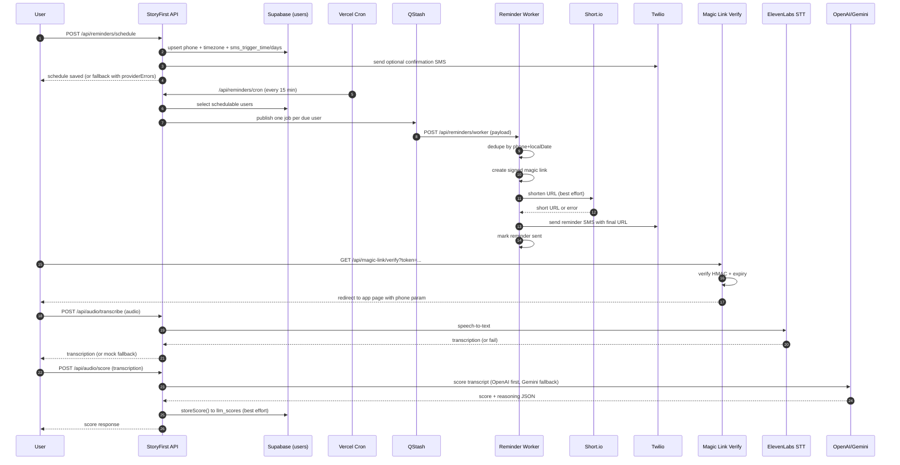

# StoryFirst Execution Flow (Cron, SMS, LLM, Short.io, Magic Link)

This document explains how the current code executes reminder delivery and audio scoring.

## 1) Reminder Scheduling (User sets days/time)

Entry point: `POST /api/reminders/schedule`

1. Validates `phone`, `scheduleDays`, `scheduleTime`, `timezone`.
2. Normalizes schedule:
   - Days -> integer array (`0-6`) via `normalizeScheduleDays`.
   - Time -> `HH:MM` 24h via `normalizeScheduleTimeTo24h`.
3. Sends optional confirmation SMS using Twilio.
4. Upserts `users` with:
   - `sms_trigger_time`
   - `sms_trigger_days`
   - `timezone`
5. If Supabase upsert fails, falls back to local file storage (`data/reminders.json`) so the schedule is not lost.

## 2) Vercel Cron -> QStash -> Worker -> Twilio

Configured in `vercel.json`:
- `*/15 * * * *` -> `/api/reminders/cron`
- `0 0 * * *` -> `/api/reminders/cleanup`
- `0 9 * * 1` -> `/api/reminders/weekly-ai` (currently placeholder)

### 2.1 Cron scan (`/api/reminders/cron`)
1. Authorizes using `CRON_SECRET` header/bearer.
2. Reads schedulable users from Supabase `users`.
3. Filters users due in current 15-minute window by local timezone/day/time.
4. Publishes one QStash job per due user to `/api/reminders/worker`.

### 2.2 Job worker (`/api/reminders/worker`)
1. Authorizes with `REMINDER_WORKER_SECRET` (or `CRON_SECRET` fallback).
2. De-dupes by `phone + localDate` using `data/reminder-dispatch-state.json`.
3. Builds signed magic link (`/api/magic-link/verify?token=...`).
4. Attempts Short.io shortening; falls back to long URL if shortening fails.
5. Sends SMS through Twilio with lesson link.
6. Marks reminder as sent for that local date.

### 2.3 Cleanup (`/api/reminders/cleanup`)
1. Runs daily.
2. Removes old de-dupe entries (older than 3 days) from `reminder-dispatch-state.json`.

## 3) Magic Link Verification

Entry point: `GET /api/magic-link/verify?token=...`

1. Decodes and verifies HMAC token from `MAGIC_LINK_SECRET`.
2. Enforces max age (1 hour).
3. On success redirects to safe internal path and appends `phone` query param.
4. On failure redirects with error (`no-token`, `invalid-token`, `server-error`).

## 4) Twilio SMS Integration

Shared sender: `sendTwilioSMS()`

1. Validates required env vars:
   - `TWILIO_ACCOUNT_SID`
   - `TWILIO_AUTH_TOKEN`
   - `TWILIO_FROM_NUMBER` (or `TWILIO_PHONE_NUMBER`)
2. Normalizes phone numbers to E.164.
3. Calls Twilio REST API (`Messages.json`).
4. Returns structured success/failure with provider errors and Twilio SID/status.

## 5) Short.io Integration

Shared helper: `shortenWithShortIo()`

1. Requires:
   - `SHORT_IO_API_KEY`
   - `SHORT_IO_DOMAIN`
2. Calls `POST https://api.short.io/links`.
3. Returns short URL when available.
4. On any failure, returns provider errors and caller uses original long URL.

## 6) ElevenLabs + OpenAI Scoring Flow

### 6.1 Transcription (`POST /api/audio/transcribe`)
1. Accepts audio file form-data.
2. If `ELEVENLABS_API_KEY` exists, calls ElevenLabs STT (`/v1/speech-to-text`).
3. Returns transcription text.
4. If key missing or provider fails, returns mock transcription fallback.

### 6.2 Scoring (`POST /api/audio/score`)
1. Accepts transcription text.
2. Provider order:
   - OpenAI first (`OPENAI_API_KEY`, model default `gpt-4o-mini`)
   - Gemini fallback (`GEMINI_API_KEY`, model default `gemini-2.5-flash`)
   - Mock fallback if both unavailable/fail
3. Parses score JSON (`score`, `reasoning`) with tolerant fallback parsing.
4. Stores score via `storeScore()` into `llm_scores` (best effort).

## 7) Current State Notes

- `/api/reminders/weekly-ai` exists but is not yet processing real weekly grading batches.
- There are legacy local-file reminder paths (`/api/reminders/dispatch`, `/api/reminders/sendDue`) kept as fallback/testing utilities; DB + cron + QStash worker is the primary path.

## 8) Sequence Diagram

