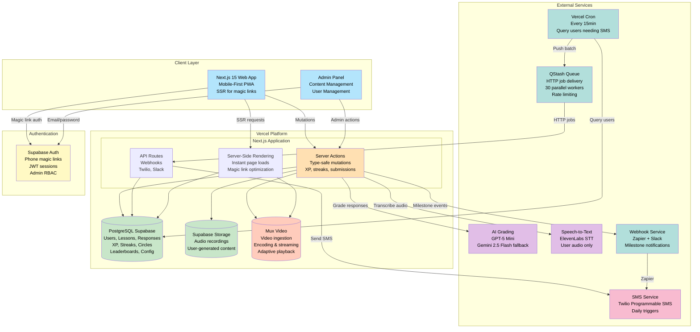
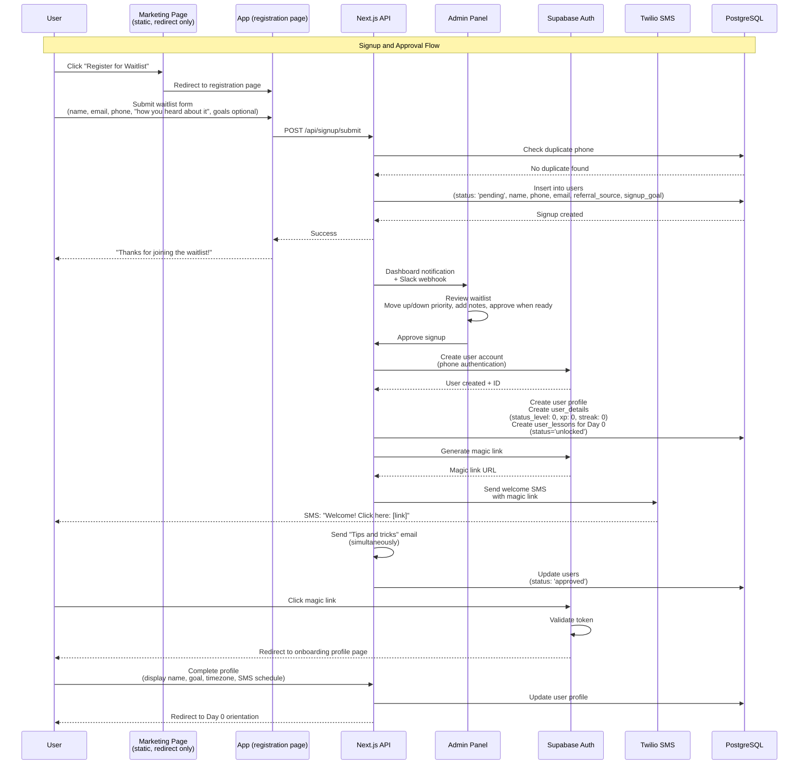
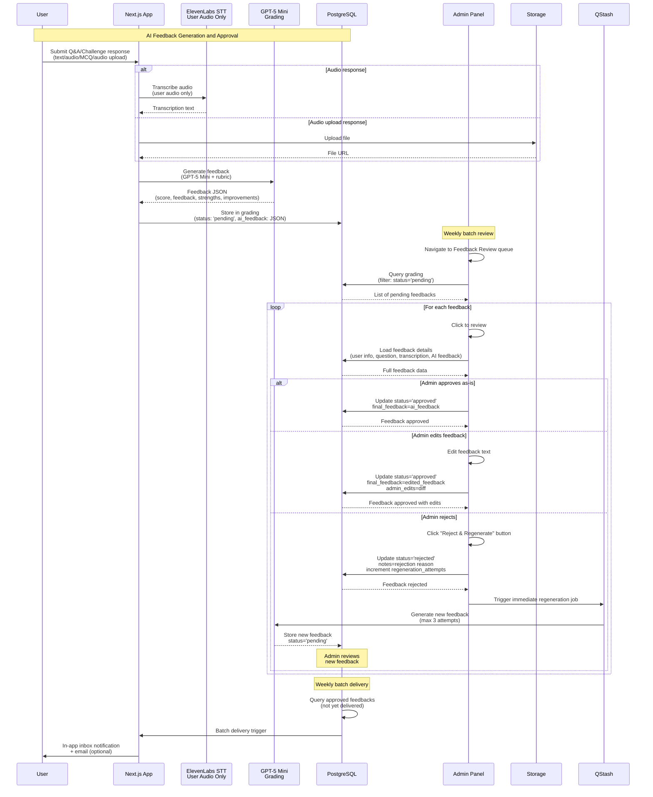
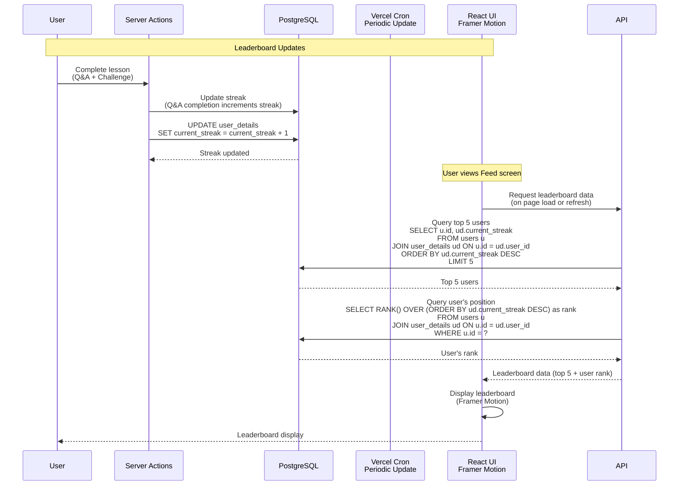
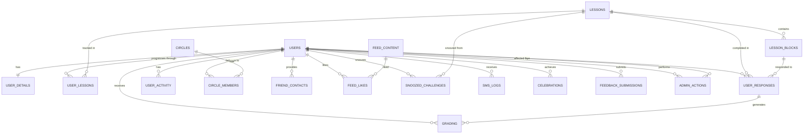

# StoryFirst - Technical Requirements Document (TRD)

## 1. Cover Page

| Field               | Details                              |
| ------------------- | ------------------------------------ |
| **Project Name**    | StoryFirst                           |
| **Client**          | Sonny Caberwal                       |
| **Version**         | 1.0                                  |
| **Date**            | February 12, 2026                    |
| **Document Author** | DevSavant - Product Engineering Team |
| **Status**          | Draft - Ready for Client Review      |

---

## Table of Contents

1. [Cover Page](#1-cover-page)
2. [Introduction](#2-introduction)
   - [2.1 Document Purpose](#21-document-purpose)
   - [2.2 Relationship to PRD](#22-relationship-to-prd)
   - [2.3 Audience](#23-audience)
   - [2.4 Document Overview](#24-document-overview)
3. [Technical Architecture](#3-technical-architecture)
   - [3.1 Proposed Architecture](#31-proposed-architecture)
   - [3.2 Selected Technologies](#32-selected-technologies)
   - [3.3 Architecture Diagrams](#33-architecture-diagrams)
     - [3.3.1 High-Level System Architecture](#331-high-level-system-architecture)
     - [3.3.2 User Onboarding and Authentication Flow](#332-user-onboarding-and-authentication-flow)
     - [3.3.3 Daily Lesson Flow](#333-daily-lesson-flow)
     - [3.3.4 AI Feedback Approval Flow (Admin Portal)](#334-ai-feedback-approval-flow-admin-portal)
     - [3.3.5 Leaderboard Update Flow](#335-leaderboard-update-flow)
4. [Technical Requirements Mapping](#4-technical-requirements-mapping)
   - [4.1 BR-01 → TR-01: User Onboarding and Authentication](#41-br-01--tr-01-user-onboarding-and-authentication)
   - [4.2 BR-02 → TR-02: Daily Lesson Delivery System](#42-br-02--tr-02-daily-lesson-delivery-system)
   - [4.3 BR-11 → TR-03: Content Management System](#43-br-11--tr-03-content-management-system)
   - [4.4 BR-04 → TR-04: XP and Status System](#44-br-04--tr-04-xp-and-status-system)
   - [4.5 BR-05 → TR-05: Streak Tracking System](#45-br-05--tr-05-streak-tracking-system)
   - [4.6 BR-06 → TR-06: Leaderboard System](#46-br-06--tr-06-leaderboard-system)
   - [4.7 BR-07B → TR-07: AI Feedback Approval System](#47-br-07b--tr-07-ai-feedback-approval-system)
   - [4.8 BR-08 → TR-08: Story Circles](#48-br-08--tr-08-story-circles)
   - [4.9 BR-09 → TR-09: Feed and Navigation](#49-br-09--tr-09-feed-and-navigation)
   - [4.10 BR-10 → TR-10: User Profile and Settings](#410-br-10--tr-10-user-profile-and-settings)
   - [4.11 BR-11 → TR-11: Admin Panel](#411-br-11--tr-11-admin-panel)
   - [4.12 BR-02 → TR-12: SMS Notification System](#412-br-02--tr-12-sms-notification-system)
   - [4.13 BR-13 → TR-13: Celebration Moments](#413-br-13--tr-13-celebration-moments)
   - [4.14 BR-14 → TR-14: Alpha/Beta User Feedback Tool](#414-br-14--tr-14-alphabeta-user-feedback-tool)
5. [Non-Functional Requirements](#5-non-functional-requirements)
   - [5.1 Security](#51-security)
   - [5.2 Scalability](#52-scalability)
   - [5.3 Usability](#53-usability)
6. [Data Design](#6-data-design)
   - [6.1 Database Tables Overview](#61-database-tables-overview)
   - [6.2 Entity-Relationship Model](#62-entity-relationship-model)
   - [6.3 Data Dictionary](#63-data-dictionary)
   - [6.4 Database Versioning and Migration Policies](#64-database-versioning-and-migration-policies)
7. [Integrations and APIs](#7-integrations-and-apis)
   - [7.1 External Services](#71-external-services)
   - [7.2 API Specifications](#72-api-specifications)
8. [User Interface (Technical)](#8-user-interface-technical)
   - [8.1 Design System](#81-design-system)
   - [8.2 Key UI Components](#82-key-ui-components)
   - [8.3 Form Validation](#83-form-validation)
9. [Infrastructure Requirements](#9-infrastructure-requirements)
   - [9.1 Environments](#91-environments)
   - [9.2 CI/CD Pipeline](#92-cicd-pipeline)
   - [9.3 Scheduled Jobs (Vercel Cron + QStash)](#93-scheduled-jobs-vercel-cron--qstash)
10. [Testing and QA](#10-testing-and-qa)
   - [10.1 Testing Strategy](#101-testing-strategy)
   - [10.2 Unit Testing](#102-unit-testing)
   - [10.3 Integration Testing](#103-integration-testing)
   - [10.4 End-to-End Testing](#104-end-to-end-testing)
11. [Technical Assumptions and Limitations](#11-technical-assumptions-and-limitations)
   - [11.1 Assumptions](#111-assumptions)
   - [11.2 Limitations](#112-limitations)
   - [11.3 Technology Dependencies](#113-technology-dependencies)
   - [11.4 External Dependencies (Client-Provided Requirements)](#114-external-dependencies-client-provided-requirements)
12. [Technical Roadmap](#12-technical-roadmap)
   - [12.1 Cycle 1: Foundation, Authentication & Onboarding](#121-cycle-1-foundation-authentication--onboarding)
   - [12.2 Cycle 2: Admin Panel – Content, Users & Circles](#122-cycle-2-admin-panel--content-users--circles)
   - [12.3 Cycle 3: Lesson System & Personalization](#123-cycle-3-lesson-system--personalization)
   - [12.4 Cycle 4: Gamification & Engagement Systems](#124-cycle-4-gamification--engagement-systems)
   - [12.5 Cycle 5: AI Feedback & Social Features](#125-cycle-5-ai-feedback--social-features)
   - [12.6 Cycle 6: Admin Panel & SMS System – Notifications & Testing](#126-cycle-6-admin-panel--sms-system--notifications--testing)
   - [12.7 Phase 2: Enhanced Features (Post-MVP)](#127-phase-2-enhanced-features-post-mvp)
   - [12.8 Phase 3: Advanced Features](#128-phase-3-advanced-features)
   - [12.9 Testing & Launch (Ongoing)](#129-testing--launch-ongoing)
13. [Infrastructure Cost Analysis](#13-infrastructure-cost-analysis)
   - [13.1 Monthly Cost Breakdown (MVP Launch)](#131-monthly-cost-breakdown-mvp-launch)
   - [13.2 Growth Scenario (1,000-5,000 Users)](#132-growth-scenario-1000-5000-users)
   - [13.3 Cost Optimization Strategies](#133-cost-optimization-strategies)
   - [13.4 Scaling Considerations](#134-scaling-considerations)
14. [Appendices](#14-appendices)
   - [14.1 Glossary](#141-glossary)
   - [14.2 References](#142-references)
   - [14.3 Document Revision History](#143-document-revision-history)

---

## 2. Introduction

### 2.1 Document Purpose

This Technical Requirements Document (TRD) details the technical vision, architecture, and implementation specifications for StoryFirst MVP. The document provides comprehensive technical guidance for the development, deployment, and maintenance of a gamified storytelling learning platform that delivers daily lessons via SMS, tracks user progress through XP and status systems, and fosters social accountability through Story Circles.

### 2.2 Relationship to PRD

This document translates the Business Requirements (BR-01, BR-02, BR-04 through BR-11, BR-13, BR-14) defined in the StoryFirst PRD into Technical Requirements (TR-01 through TR-14) with detailed implementation specifications. Each technical requirement section provides step-by-step implementation details, security considerations, data integrity requirements, and acceptance criteria needed to fulfill its corresponding business requirement from the PRD.

**Note:** BR-03 (Daily Review Session) and BR-12 (Post-Completion Experience) are deferred to Phase 2 and Phase 3 respectively, and do not have corresponding technical requirements in MVP.

**Reference Documents:**

- Twilio API Documentation
- Supabase Documentation
- ElevenLabs API Documentation
- OpenAI API Documentation
- Short.io API Documentation
- QStash (Upstash) Documentation
- Zapier API Documentation

### 2.3 Audience

This document is intended for:

- **Technical Team:** Software engineers, full-stack developers, and AI/ML engineers responsible for implementation
- **Quality Assurance:** Test engineers who will validate the technical implementation against requirements
- **System Architects:** Technical architects responsible for system design and integration patterns
- **DevOps Engineers:** Infrastructure and deployment specialists managing CI/CD pipelines and cloud resources
- **Technical Leadership:** CTOs, engineering managers, and technical leads overseeing the project
- **Security Team:** Security engineers ensuring compliance and data protection
- **Business Stakeholders:** Product owners, project sponsors, and decision-makers (Sonny Caberwal, Holly, Jessie)
- **Content Team:** Content creators (Holly, Jessie) who need to understand the CMS capabilities
- **Integration Partners:** Third-party technical coordinators (Twilio, Supabase, ElevenLabs, OpenAI)

### 2.4 Document Overview

This document is organized into the following sections:

1. **Cover Page** - Document metadata and version information
2. **Introduction** - Document purpose, audience, and overview
3. **Technical Architecture** - System design, technology stack, and architectural patterns
4. **Technical Requirements Mapping** - Detailed mapping of business requirements to technical implementations (TR-01 through TR-14)
5. **Non-Functional Requirements** - Security, performance, scalability, and other quality attributes
6. **Data Design** - Database schemas, entity relationships, and data structures
7. **Integrations and APIs** - External services (Twilio, OpenAI, ElevenLabs, Slack, Zapier), API specifications, and integration patterns
8. **User Interface (Technical)** - Design systems, UI components, and interface specifications
9. **Infrastructure Requirements** - Environments, deployment, monitoring, and CI/CD
10. **Testing and QA** - Testing approach, test cases, and quality assurance
11. **Technical Assumptions and Limitations** - Constraints, dependencies, and known limitations
12. **Technical Roadmap** - Phase plans, timelines, and deliverables
13. **Infrastructure Cost Analysis** - Cost projections and scaling considerations
14. **Appendices** - Glossary, references, and revision history

---

## 3. Technical Architecture

### 3.1 Proposed Architecture

**High-Level Architecture Pattern:**

- **Client Layer:** Next.js 15 web application (App Router) with responsive design optimized for mobile-first experience. Server-side rendering (SSR) for instant page loads via SMS magic links. Progressive Web App (PWA) capabilities for app-like experience without native app complexity.

- **Authentication Layer:** Supabase Auth with phone number authentication (magic links via SMS). No password required—users receive magic links to access lessons. JWT-based session management with secure token refresh. Admin authentication uses email/password with role-based access control (RBAC).
  - **API Layer:** Next.js Server Actions serving as primary API layer. Type-safe mutations with end-to-end type safety from database to UI. API Routes for webhooks (Twilio delivery status, Slack webhooks). Edge Runtime support for SMS trigger logic.

- **Services Layer:**
  - **AI Grading Service:** GPT-5 Mini (primary) + Gemini 2.5 Flash (fallback) for Q&A and Challenge evaluation with structured grading rubrics
  - **Speech-to-Text Service:** ElevenLabs STT for high-quality audio transcription (user responses only - Q&A and Challenge audio recordings)
  - **Text-to-Speech Service:** ElevenLabs TTS for generating personalized audio intros and wrap-ups (Pre/Post-Lesson personalization)
  - **SMS Service:** Twilio Programmable SMS for daily lesson triggers and notifications
  - **Background Jobs Service:** Vercel Cron + QStash for scheduled daily triggers, SMS job queue with rate limiting, automatic retries, and XP/streak calculations
  - **Webhook Service:** Zapier webhooks for milestone notifications (status changes, streak milestones, completion) with Slack integration
  - **LLM Observability Service:** Prompt versioning and editing managed in Admin Panel (no external service required)

- **Data Layer:**
  - **Primary Database:** PostgreSQL (Supabase) for users, lessons, responses, XP, streaks, circles, leaderboards
  - **Authentication:** Supabase Auth tables for user sessions and phone verification
  - **File Storage:** Supabase Storage for audio recordings and audio file uploads (Q&A, Challenge responses), user-generated content, and SRT caption files (generated from ElevenLabs TTS word timestamps)
  - **Video Infrastructure:** Mux for video ingestion, encoding, storage, and adaptive streaming of lesson videos

### 3.2 Selected Technologies

| Decision                             | Technology                                       | Why (Reliability Perspective)                                                                                                                                                                                                                                                                                                                                                                      | Reliability Impact                                                                                                                                                                                                                    | Cost (approx.)                                                |
| :----------------------------------- | :----------------------------------------------- | :------------------------------------------------------------------------------------------------------------------------------------------------------------------------------------------------------------------------------------------------------------------------------------------------------------------------------------------------------------------------------------------------- | :------------------------------------------------------------------------------------------------------------------------------------------------------------------------------------------------------------------------------------ | :------------------------------------------------------------ |
| **Framework + Hosting**              | **Next.js 15 on Vercel**                         | Next.js App Router provides **production-ready SSR** for magic link optimization, native streaming support for AI feedback, and Edge Runtime for global SMS triggers. Vercel provides **zero-downtime deploys**, automatic HTTPS, preview deployments for content team, and built-in analytics. Server Actions eliminate separate API layer complexity.                                            | Single deployment artifact reduces complexity; Vercel's auto-rollback prevents broken deploys. SSR ensures instant page loads for SMS magic links.                                                                                    | **$20/mo** (Pro tier)                                         |
| **Database**                         | **PostgreSQL (Supabase)**                        | Supabase-managed PostgreSQL with **built-in Auth, storage, and Row-Level Security (RLS)**. Automatic backups, connection pooling, and ACID compliance. Perfect for relational data (XP transactions, streak history, circle memberships). JSONB support for flexible lesson content (block-based CMS).                                                                                             | Proven stability with ACID compliance; automatic failover and daily backups ensure data durability. Built-in auth reduces custom authentication code.                                                                                 | **$25/mo** (Pro tier)                                         |
| **AI Provider (Grading)**            | **OpenAI GPT-5 Mini (primary) + Gemini 2.5 Flash (fallback)** | GPT-5 Mini offers **excellent grading quality, consistent rubric adherence, and coach-like feedback tone**. Gemini 2.5 Flash provides fallback for cost optimization. Both offer regional redundancy and auto-scaling. Vercel AI SDK enables easy provider switching if one experiences downtime.                                                                                                                      | Consistent availability across providers; structured outputs ensure reliable grading format. Fallback provider prevents downtime.                                                                                                     | **~$1/mo** (MVP launch, scales with usage)                             |
| **Speech-to-Text (User Audio)**      | **ElevenLabs STT**                               | **Best transcription quality for expressive speech**, optimized pronunciation models, and lower word error rate (WER) = better grading accuracy. Used exclusively for transcribing user audio responses (Q&A and Challenge recordings). Simple API integration with reliable uptime.                                                                 *                                              | High-quality transcription reduces downstream errors in AI grading; better user experience with fewer complaints.                                                                                                                     | **~$15-20/mo** (MVP: ~50 audio min/month; scales with audio volume)          |
| **Text-to-Speech (Personalization)** | **ElevenLabs TTS**                               | **High-quality voice synthesis** for personalized Pre/Post-Lesson audio. Generates natural-sounding speech from template-based personalized text (templates with placeholders filled from database). Supports voice cloning and emotional delivery. Used for Pre-Lesson intros and Post-Lesson wrap-ups with user name, day, streak, XP, and status personalization.                                                                                                | Natural-sounding personalized audio enhances user engagement; voice consistency creates cohesive experience.                                                                                                                          | **$22/mo** (Creator plan)  |
| **Video Infrastructure**            | **Mux**                                          | **Purpose-built for product-embedded video** with automatic adaptive bitrate streaming (HLS/DASH). Developer-first APIs integrate seamlessly with Next.js. Handles video ingestion, encoding, storage, and global delivery. Eliminates need to build custom encoding pipelines or manage CDN configuration. Advanced video analytics available when needed.                                                                                                 | Reliable adaptive video playback across devices and networks. No custom video infrastructure to maintain. Usage-based pricing scales with engagement. Future support for DRM and signed playback URLs.                                                                                              | **~$3-4/mo** (MVP launch), scales with video delivery volume    |
| **SMS Provider**                     | **Twilio Programmable SMS**                      | **99.95% delivery rate** (critical for engagement), excellent webhook support for delivery tracking, Verify API for phone verification, industry-standard documentation. Reliable global delivery with automatic carrier routing.                                                                                                                                                                  | High delivery rate ensures users receive daily triggers; webhook support enables retry logic for failed deliveries.                                                                                                                   | **~$12/mo** (MVP launch), scales linearly with user base    |
| **Background Jobs**                  | **Vercel Cron + QStash**                         | **Serverless HTTP queue** designed for delayed jobs, retries, and rate-limited fan-out. Vercel Cron (every 15min) queries users needing SMS, pushes batch to QStash queue. QStash delivers jobs as HTTP requests to Next.js API routes. Native concurrency control (30 workers) matches Twilio rate limits. Built-in retries with exponential backoff. Zero infrastructure (no Redis, no workers). | Database-driven scheduling (not per-user jobs). Single cron job scales to 100k+ users. Native rate limiting prevents Twilio rate limit violations. Automatic retries ensure reliable SMS delivery.                                    | **$20/mo** (Vercel Pro $20 + QStash free tier covers initial needs)                      |
| **Animations**                       | **Framer Motion**                                | **Gold standard for React animations** with declarative API, excellent performance, and tree-shaking. Critical for Duolingo-style gamification (XP popups, streak animations, badge celebrations).                                                                                                                                                                                                 | Performant animations prevent UI jank; declarative API reduces animation bugs; tree-shaking minimizes bundle size.                                                                                                                    | Free (open source)                                            |
| **Styling**                          | **Tailwind CSS + Shadcn/UI**                     | Tailwind: **2-3x faster than CSS Modules**, JIT compiler only includes used styles, optimal bundle size. Shadcn/UI: **Pre-built accessible components** (dialogs, forms, tooltips) that work perfectly with Tailwind.                                                                                                                                                                              | Consistent styling reduces UI bugs; accessible components ensure WCAG compliance; optimal bundle size improves load times.                                                                                                            | Free (open source)                                            |
| **Link Shortening**                  | **Short.io**                                     | **Custom branded domain support** for SMS magic links with per-link expiration (24-hour TTL), link revocation, and advanced click analytics. API-first approach enables programmatic link creation before SMS send. Multi-channel support (SMS, email, web). SMS provider agnostic - not locked to Twilio.                                                                                              | Branded links enhance user trust and engagement. Per-link expiration ensures security for magic links. Link revocation provides security control. Advanced analytics track user engagement.                                                                                                            | **$18/mo** (Pro plan)                                        |
| **Webhook Integration**              | **Zapier + Slack**                               | **Standard webhook format** with Zapier integration for milestone notifications. Admin team configures Zapier webhook URL (Zapier routes to Slack). No-code automation support - admin team can set up Slack workflows without developer. Supports status changes, streak milestones, program completion.                                                                                          | Native Slack integration via Zapier (primary use case). Standard webhook format compatible with any receiver. Reliable delivery with retries. Admin-configurable webhook URLs.                                                        | **Free tier** (~$0/mo), **Starter tier** (~$20/mo) for growth |


### 3.3 Architecture Diagrams

#### 3.3.1 High-Level System Architecture



#### 3.3.2 User Onboarding and Authentication Flow



**Summary: User Onboarding and Authentication Flow**

| Step                    | What Happens                                                                                                 |
| ----------------------- | ------------------------------------------------------------------------------------------------------------ |
| 1. User signs up        | User lands on in-app registration page (redirect from marketing page). Submits waitlist form with name, email, phone, "how you heard about it" (required), goals/reminder time (optional). |
| 2. Signup stored        | API validates phone number, checks for duplicates, stores in `users` table with status='pending'. |
| 3. Admin notified       | Admin receives dashboard notification AND Slack message (webhook) for new signup. Admin Panel shows pending approvals count badge on signup queue. |
| 4. Admin reviews        | Admin reviews waitlist, moves users up/down priority, adds notes, approves when ready (or rejects) with optional message. |
| 5. Admin approves       | If approved: Admin clicks "Approve" → API creates Supabase Auth user account                                              |
| 6. User profile created | API creates user profile in `users` table, `user_details` table with initial values (status_level: 0, xp: 0, streak: 0), and `user_lessons` table for Day 0 (status='unlocked')            |
| 7. Magic link generated | Supabase Auth generates magic link with redirect to onboarding                                               |
| 8. Welcome SMS sent     | Twilio sends SMS to user with magic link                                                                     |
| 9. Tips email sent      | "Tips and tricks" email sent simultaneously upon approval                                                    |
| 10. User clicks link    | User clicks magic link from SMS                                                                              |
| 11. Authentication      | Supabase Auth validates token, creates session                                                               |
| 12. Profile setup       | User redirected to onboarding profile page to complete profile                                               |
| 13. Day 0 access        | After profile completion, user gains access to Day 0 orientation lesson                                      |
| 14. Day 1 access        | Day 1 immediately unlocks after Day 0 completion (no gap)                                                    |

#### 3.3.3 Daily Lesson Flow

```mermaid
sequenceDiagram
    participant User
    participant VercelCron as Vercel Cron<br/>Every 15min
    participant QStash as QStash Queue<br/>HTTP Job Delivery
    participant API as Next.js API Route<br/>SMS Worker
    participant ShortIO as Short.io<br/>Link Shortening
    participant Twilio as Twilio SMS
    participant NextJS as Next.js SSR
    participant ServerAction as Server Actions
    participant STT as ElevenLabs STT<br/>User Audio Only
    participant TTS as ElevenLabs TTS<br/>Personalization Audio
    participant AI as GPT-5 Mini<br/>Grading
    participant DB as PostgreSQL
    participant Storage as Supabase Storage
    participant Mux as Mux Video<br/>Adaptive Streaming
    Note over User,DB: Daily Lesson Delivery and Completion

    VercelCron->>VercelCron: Cron: Every 15min<br/>Query users needing SMS
    VercelCron->>DB: SELECT users WHERE<br/>preferred_time <= NOW()<br/>AND sms_sent_today = false
    DB-->>VercelCron: Batch of 50-100 users

    VercelCron->>QStash: Publish batch to queue<br/>(one API call)
    QStash->>QStash: Spawn 30 parallel workers<br/>(matches Twilio rate limit)

    loop For each worker (30 concurrent)
        QStash->>API: HTTP POST job<br/>{userId, lessonDay, phone}
        API->>DB: Check lesson availability
        DB-->>API: Lesson exists
        API->>ServerAction: Generate magic link
        ServerAction->>DB: Create auth token
        ServerAction-->>API: Magic link URL
        API->>ShortIO: Create shortened link<br/>(custom domain, 24h expiration)
        ShortIO-->>API: Shortened link URL
        API->>Twilio: Send SMS<br/>(message variant + shortened link)
        Twilio-->>User: SMS: "Day X is ready: [link]"
        API->>DB: UPDATE users<br/>SET sms_sent_today = true
        API-->>QStash: Job completed
    end

    alt SMS fails
        QStash->>QStash: Automatic retry<br/>(exponential backoff)
        QStash->>API: Retry HTTP POST
    end

    User->>NextJS: Click magic link
    NextJS->>NextJS: SSR: Verify session<br/>Check lesson access
    NextJS->>DB: Fetch lesson content
    DB-->>NextJS: Lesson blocks
    NextJS-->>User: Render lesson UI

    User->>NextJS: Complete Pre-Lesson intro
    NextJS->>DB: Fetch user data<br/>(name, current lesson day from user_lessons, streak)
    DB-->>NextJS: User data
    NextJS->>NextJS: Fill template with user data<br/>(template + {name}, {day}, {streak})
    NextJS->>TTS: Generate audio from template text<br/>(ElevenLabs TTS)
    TTS-->>NextJS: Personalized intro audio<br/>+ word-level timestamps
    NextJS->>NextJS: Process word timestamps<br/>Generate SRT file
    NextJS->>Storage: Save SRT file<br/>(Supabase Storage)
    Storage-->>NextJS: SRT file URL
    NextJS->>NextJS: Convert SRT to WebVTT<br/>Attach <track> to audio player
    NextJS-->>User: Play audio intro<br/>with karaoke captions<br/>(TextTrack API syncs phrases,<br/>requestAnimationFrame highlights words)

    User->>NextJS: Watch Direct Instruction video<br/>(with karaoke captions)
    NextJS->>NextJS: Extract Mux playback ID<br/>from lesson block content
    NextJS->>Mux: Load video via Mux Player SDK<br/>(adaptive streaming HLS/DASH)
    Mux-->>NextJS: Video stream (adaptive bitrate)
    NextJS-->>User: Mux Player + karaoke captions overlay

    NextJS->>DB: Fetch user name
    DB-->>NextJS: User name
    NextJS->>NextJS: Fill template with user name<br/>(template + {name})
    NextJS->>TTS: Generate audio<br/>(ElevenLabs TTS)
    TTS-->>NextJS: Transition audio<br/>+ word-level timestamps
    NextJS->>NextJS: Generate SRT → Convert to WebVTT<br/>Attach <track> to audio player
    NextJS-->>User: Play transition<br/>with karaoke captions<br/>("Hey [Name], now we're going to talk about this")

    User->>NextJS: Submit Q&A response<br/>(text/audio/MCQ/audio upload)
    alt Audio response
        NextJS->>Storage: Upload audio file
        Storage-->>NextJS: Audio URL
        NextJS->>STT: Transcribe audio<br/>(ElevenLabs STT)
        STT-->>NextJS: Transcription text
    else Audio upload response
        NextJS->>Storage: Upload file
        Storage-->>NextJS: File URL
    end
    NextJS->>AI: Grade response<br/>(GPT-5 Mini + rubric)
    AI-->>NextJS: Grading JSON<br/>(score, feedback, strengths, improvements)
    NextJS->>DB: Store response + grading

    User->>NextJS: Submit Challenge response<br/>(text/audio/MCQ/audio upload)
    alt Audio response
        NextJS->>Storage: Upload audio file
        NextJS->>STT: Transcribe audio<br/>(ElevenLabs STT)
        STT-->>NextJS: Transcription text
    else Audio upload response
        NextJS->>Storage: Upload file
        Storage-->>NextJS: File URL
    end
    NextJS->>AI: Grade response
    AI-->>NextJS: Grading JSON
    NextJS->>DB: Store response + grading

    NextJS->>ServerAction: Complete lesson
    ServerAction->>DB: Calculate XP<br/>(Q&A: 1 XP, Challenge: 2 XP)
    ServerAction->>DB: Update streak<br/>(if Q&A completed)
    ServerAction->>DB: Check status progression
    ServerAction->>DB: Check celebration triggers

    alt Status 0 User
        ServerAction-->>NextJS: Completion message<br/>"Great job! Your response has been saved.<br/>Complete more lessons to unlock AI feedback!"
        NextJS-->>User: Display message<br/>(XP and streak update visible)
    else Status 1+ User
        ServerAction->>DB: Store response for<br/>weekly AI feedback
        Note over DB: AI feedback generated<br/>and queued for admin approval<br/>(delivered weekly, not immediately)
    end

    ServerAction->>DB: Fetch user data<br/>(name, xp_earned, streak, status)
    DB-->>ServerAction: User data
    ServerAction->>ServerAction: Fill template with user data<br/>(template + {name}, {xp}, {streak}, {status})
    ServerAction->>TTS: Generate wrap-up audio<br/>(ElevenLabs TTS)
    TTS-->>ServerAction: Wrap-up audio<br/>+ word-level timestamps
    ServerAction->>ServerAction: Process word timestamps<br/>Generate SRT file
    ServerAction->>Storage: Save SRT file<br/>(Supabase Storage)
    Storage-->>ServerAction: SRT file URL
    ServerAction-->>NextJS: Wrap-up audio + SRT URL + stats
    NextJS->>NextJS: Convert SRT to WebVTT<br/>Attach <track> to audio player
    NextJS-->>User: Play wrap-up audio<br/>with karaoke captions<br/>(TextTrack API syncs phrases,<br/>requestAnimationFrame highlights words)<br/>+ redirect to Feed
```



**Summary: Daily Lesson Flow**

| Step                         | What Happens                                                                                                                        |
| ---------------------------- | ----------------------------------------------------------------------------------------------------------------------------------- |
| 1. Scheduled trigger         | Vercel Cron runs every 15 minutes, queries Supabase for users needing SMS (database-driven scheduling)                              |
| 2. User query                | System queries: `SELECT users WHERE preferred_time <= NOW() AND sms_sent_today = false`                                             |
| 3. Batch to queue            | System pushes entire batch (50-100 users) to QStash queue in one API call                                                           |
| 4. QStash distribution       | QStash spawns 30 parallel workers (matches Twilio rate limit), delivers jobs as HTTP requests                                       |
| 5. SMS worker                | Each API route worker: Generates magic link → Creates Short.io shortened link (24h expiration) → Sends Twilio SMS → Marks user as sent                                                 |
| 6. Automatic retries         | If Twilio SMS fails, QStash automatically retries with exponential backoff                                                          |
| 5. User clicks link          | User clicks magic link from SMS                                                                                                     |
| 6. SSR page load             | Next.js SSR verifies session and queries `user_lessons` table to check lesson access (sequential unlock enforced via status check)                                                           |
| 7. Lesson content fetched    | System fetches lesson blocks from database (includes Mux asset ID, playback ID, and status for Direct Instruction blocks)                                                                                          |
| 8. Pre-Lesson intro          | Template-based personalized intro (template + user name, current lesson day from user_lessons, streak from DB) → ElevenLabs TTS generates audio with word-level timestamps → Server generates SRT file → Frontend converts SRT to WebVTT → Attach <track> to audio player → TextTrack API syncs phrases → Word-level segments enable karaoke highlighting via requestAnimationFrame → User plays audio intro with karaoke-style captions |
| 9. Direct Instruction        | Next.js extracts Mux playback ID from `lesson_blocks.content` JSONB → Checks `mux_status` (must be "ready") → Mux Player SDK loads video using playback ID (automatically constructs video URL) → Adaptive streaming (HLS/DASH) → User watches video with karaoke-style captions overlay                                                                                      |
| 10. Personalization Transition | Transition block plays: "Hey [Name], now we're going to talk about this" (template + user name from DB + TTS)                               |
| 11. Q&A response             | User records audio → Uploads to Supabase Storage → Transcribed via ElevenLabs STT → Graded via GPT-5 Mini                              |
| 12. Challenge response       | Same flow as Q&A (audio → storage → transcription → grading)                                                                        |
| 13. Lesson completion        | Server Action calculates XP, updates streak, checks status progression, fires webhooks                                              |
| 14. Status handling          | Status 0: Shows completion message (no AI Feedback). Status 1+: Response stored for weekly AI feedback                              |
| 15. Wrap-up                  | Template-based personalized wrap-up (template + user name, XP, streak, status from DB) → ElevenLabs TTS generates audio with word-level timestamps → Server generates SRT file → Frontend converts SRT to WebVTT → Attach <track> to audio player → TextTrack API syncs phrases → Word-level segments enable karaoke highlighting via requestAnimationFrame → User plays wrap-up audio with karaoke-style captions                    |
| 16. Feed redirect            | User redirected to Feed tab with updated stats                                                                                      |

#### 3.3.4 AI Feedback Approval Flow (Admin Portal)



**Summary: AI Feedback Approval Flow**

| Step                      | What Happens                                                                                          |
| ------------------------- | ----------------------------------------------------------------------------------------------------- |
| 1. User submits response  | User completes Q&A or Challenge, response submitted (text/audio/MCQ)                                        |
| 2. Audio transcription    | ElevenLabs STT transcribes user audio to text                             |
| 3. AI feedback generation | GPT-5 Mini generates structured feedback (score, feedback text, strengths, improvements) based on rubric |
| 4. Store pending feedback | System stores feedback in `grading` table with status='pending'                              |
| 5. Admin review queue     | Admin navigates to Feedback Review section, sees all pending feedbacks                                |
| 6. Admin reviews          | Admin clicks feedback to review: sees user info, question, transcription, and AI-generated feedback   |
| 7a. Approve as-is         | Admin approves AI feedback without changes → status='approved', final_feedback=ai_feedback            |
| 7b. Edit feedback         | Admin edits feedback text → status='approved', final_feedback=edited_feedback, admin_edits tracked    |
| 7c. Reject feedback       | Admin clicks "Reject & Regenerate" button → status='rejected', system immediately triggers AI to generate new feedback (no manual write required) → New feedback stored with status='pending' → Admin reviews again                      |
| 8. Weekly batch delivery  | System batches approved feedbacks and delivers to users via in-app inbox                              |
| 9. User notification      | User receives notification when feedback is available                                                 |

#### 3.3.5 Leaderboard Update Flow



**Summary: Leaderboard Update Flow**

| Step                      | What Happens                                                                                                                          |
| ------------------------- | ------------------------------------------------------------------------------------------------------------------------------------- |
| 1. User completes lesson  | User finishes Q&A and Challenge, Server Action updates streak (Q&A completion increments streak)                                     |
| 2. Streak updated         | System updates `user_details.current_streak` in database                                                                                     |
| 3. User views Feed        | When user views Feed screen, API queries leaderboard data on-demand                                                          |
| 4. Global leaderboard     | API queries top 5 users using `SELECT u.id, ud.current_streak FROM users u JOIN user_details ud ON u.id = ud.user_id ORDER BY ud.current_streak DESC LIMIT 5` |
| 5. User position       | API queries user's rank using `SELECT RANK() OVER (ORDER BY ud.current_streak DESC) as rank FROM users u JOIN user_details ud ON u.id = ud.user_id WHERE u.id = ?` if user not in top 5 |
| 6. Circle leaderboards    | If user in circle: API queries top 5 circle members using `SELECT u.id, ud.current_streak FROM users u JOIN user_details ud ON u.id = ud.user_id JOIN circle_members cm ON u.id = cm.user_id WHERE cm.circle_id = ? ORDER BY ud.current_streak DESC LIMIT 5` |
| 7. UI display           | React UI displays leaderboard data and animates using Framer Motion                                                                                 |
| 9. User sees update       | User sees updated leaderboard with smooth animations                                                                                  |

---

## 4. Technical Requirements Mapping

### 4.1 BR-01 → TR-01: User Onboarding and Authentication

**Business Requirement Summary:**

Users sign up via in-app waitlist on the app registration page (marketing page is static and redirects to app); admin reviews waitlist (moves users up/down priority, adds notes) and approves when ready; approved users receive magic link via SMS and complete full onboarding (phone verification, goals, schedule, Coach Devon); users optionally invite friends (Status 2 benefits).

**Priority:** Critical  
**PRD Reference:** Section BR-01

**What it does:** Provides complete user onboarding flow from waitlist registration through profile completion. Marketing page is static (no forms); Register for Waitlist button redirects to the app registration page. In-app waitlist form collects signup information; admin reviews waitlist (priority order, notes) and approves when ready; approved users receive magic link via SMS; users complete full onboarding and optionally invite friends. Day 0 orientation lesson unlocks after profile completion.

**Steps:**

1. User lands on app registration page (via redirect from marketing page "Register for Waitlist" button; marketing page is static, no forms) → Submits waitlist form (name, email, phone, "how you heard about it" required, goals and reminder time optional) → Form POSTs to signup API endpoint
2. API validates phone number format and checks for duplicates → Stores signup in `users` table with status='pending' (includes name, phone, email, referral_source, signup_goal)
3. Admin receives dashboard notification AND Slack message (webhook) for new signup → Admin Panel shows pending approvals count badge on signup queue
4. Admin reviews waitlist → Views users where status='pending' → Can move users up/down priority, add notes → Approves when ready (or rejects) with optional message
5. Approval process → Updates user record (status='approved') → Creates Supabase Auth user account (phone authentication) → Generates magic link → Sends welcome SMS via Twilio
6. User clicks magic link from SMS → Supabase Auth validates token → Redirects to onboarding profile page if profile incomplete
7. User completes profile setup (display name, goal selection, timezone, SMS schedule):
   - Goal selection: User selects goals in ranked order (maximum 3 goals, primary goal first)
   - Primary goal (first ranked) used for circle assignment
   - Secondary/tertiary goals stored for analytics (not actively used in MVP)
   → Server Action updates user record
8. After profile completion → Creates `user_lessons` record for Day 0 (status='unlocked') → Redirects to Day 0 orientation lesson → Day 1 immediately unlocks after Day 0 completion (creates Day 1 record with status='unlocked')
9. Optional "Join with Friends" (during onboarding): User asked "Do you have people you want to go on this journey with?" → If Yes (2-3 friends): User provides friend contacts (phone numbers) → Friend contacts stored in `friend_contacts` table for admin review → Admin reviews friend relationships in dashboard → Admin manually creates private circle and assigns both users → Status 2 auto-granted to both users when circle is created → Private circle available from Day 1 → If Yes (team/company): Shows "Contact Admin" instead of "Invite your people" → User indicates interest → Email sent to Admin → Admin handles manually (optionally: shareable link to info page for team signups) → If No: User starts solo (assigned to goal-based circle by admin later)

**Security:**

- Phone numbers validated using libphonenumber library
- Duplicate phone check before signup submission
- Admin authentication required for approval queue access (RBAC)
- Row-Level Security (RLS) policies on all user tables
- Rate limiting on signup endpoint (10 requests per hour per IP)
- Magic links expire after 24 hours

**Data Integrity:**

- Signup submissions stored in `users` table with status='pending'
- User accounts created atomically with profile data
- Friend contacts stored in `friend_contacts` table for admin review
- Profile completion status tracked in `users` table

**Data Reliability:**

- Signup submissions persist across system restarts
- User account creation is atomic (all-or-nothing)
- Magic links validated server-side before authentication
- Failed SMS sends retried automatically via QStash

**Critical Requirements:**

- Signup form MUST validate phone number format before submission
- Admin approval MUST create user account atomically
- Magic links MUST expire after 24 hours
- Profile completion MUST unlock Day 0 orientation lesson
- "Join with Friends" MUST grant Status 2 to both users
- **Timezone verification for notifications:** When user selects a time (lesson reminder or snooze), the system MUST resolve the user's timezone to schedule delivery correctly. Users are globally located; all notifications MUST be delivered in the user's local time. System uses stored timezone preference; device/browser timezone as fallback if needed.

**Database Schema:**

See Section 6.3 Data Dictionary for detailed table definitions (`users`, `friend_contacts`).

#### Acceptance Criteria

- [ ] User can reach in-app waitlist registration page via redirect from marketing page (Register for Waitlist button); marketing page is static (no forms)
- [ ] User can submit waitlist form (name, email, phone, "how you heard about it" required; goals, reminder time optional)
- [ ] Admin receives dashboard notification when new signup submitted
- [ ] Admin Panel shows pending approvals count badge on signup queue
- [ ] Admin receives Slack message when new signup submitted (webhook to configured Slack channel)
- [ ] Admin can view users with status='pending' in approval queue
- [ ] Admin can move users up/down priority on waitlist (per PRD)
- [ ] Admin can add notes to waitlist entries
- [ ] Admin can approve when ready (or reject) with optional message (creates user account upon approval)
- [ ] Approved users receive welcome SMS with magic link
- [ ] Users can authenticate via magic link (no password required)
- [ ] Users can complete profile setup (display name, goal selection, timezone, SMS schedule)
- [ ] **Timezone verification for notifications:** When user selects a time (lesson reminder or snooze), the system MUST resolve the user's timezone to schedule delivery correctly. Users are globally located; all notifications MUST be delivered in the user's local time. System uses stored timezone preference; device/browser timezone as fallback if needed.
- [ ] Users can select goals in ranked order (maximum 3 goals, primary goal first)
- [ ] Primary goal (first ranked) used for circle assignment
- [ ] Goals cannot be edited after onboarding
- [ ] Users asked during onboarding: "Do you have people you want to go on this journey with?" (Join with Friends)
- [ ] If Yes (2-3 friends): User can invite friends/provide contacts for private circle
- [ ] If Yes (team/company): Show "Contact Admin" instead of "Invite your people"; user indicates interest → email sent to Admin → Admin handles manually. Optionally: shareable link to info page for team signups
- [ ] If No: User starts solo (assigned to goal-based circle by admin later)
- [ ] Friend contacts stored for admin review
- [ ] Admin can view friend relationships in dashboard
- [ ] Admin manually creates private circle and assigns both users
- [ ] Status 2 auto-granted to both users when circle is created
- [ ] Day 0 orientation lesson unlocks after profile completion
- [ ] Day 1 lesson unlocks immediately after Day 0 completion

---

### 4.2 BR-02 → TR-02: Daily Lesson Delivery System

**Business Requirement Summary:**

Users receive daily SMS trigger at their scheduled time (user-configurable), SMS contains magic link to today's lesson, lesson follows flow: Pre-Lesson intro (Gen AI personalized intro via ElevenLabs TTS with template-based personalization) → Direct Instruction (karaoke captions) → Q&A → Challenge → Post-Lesson wrap-up (Gen AI personalized wrap-up via ElevenLabs TTS with template-based personalization), sequential unlock (Day 2 unlocks after Day 1 completion), rolling content delivery model (7-10 days at MVP launch).

**Priority:** Critical  
**PRD Reference:** Section BR-02

**What it does:** Delivers daily lesson content to users via SMS magic links. Vercel Cron queries users needing SMS every 15 minutes, QStash queue processes SMS delivery with rate limiting, users access lessons via magic links, complete lesson flow (Pre-Lesson → Direct Instruction → Q&A → Challenge → Post-Lesson), audio responses transcribed and graded, sequential unlock prevents skipping ahead.

**Steps:**

1. Vercel Cron runs every 15 minutes → Queries Supabase for users needing SMS (database-driven scheduling)
2. System queries: `SELECT * FROM users WHERE preferred_time <= NOW() AND sms_sent_today = false` → Returns batch of 50-100 users
3. System pushes entire batch to QStash queue in one API call
4. QStash spawns 30 parallel workers (matches Twilio rate limit) → Delivers jobs as HTTP requests
5. Each worker: Generates magic link via Supabase Auth → Selects message variant (based on streak) → Sends SMS via Twilio → Marks user as sent
6. User clicks magic link from SMS → Next.js SSR verifies session → Queries `user_lessons` table to check lesson access (status must be 'unlocked' or 'in_progress', or sequential_unlock_override=true)
7. Lesson flow: Pre-Lesson intro (Gen AI personalized intro via ElevenLabs TTS with template-based personalization and karaoke captions) → Direct Instruction video (karaoke captions) → Personalization Transition (Gen AI transition via ElevenLabs TTS with karaoke captions) → Q&A (text/audio/MCQ/audio upload responses) → Challenge (text/audio/MCQ/audio upload responses) → Post-Lesson wrap-up (Gen AI personalized wrap-up via ElevenLabs TTS with template-based personalization and karaoke captions)
   - **Pre-Lesson/Post-Lesson caption flow:** ElevenLabs TTS generates audio with word-level timestamps → Server generates SRT file → SRT saved to Supabase Storage → Frontend converts SRT to WebVTT → Attaches `<track>` to audio player → TextTrack API syncs phrases → Word-level segments enable karaoke highlighting via requestAnimationFrame
8. User responses: Text responses stored directly, Audio/Audio Upload responses uploaded to Supabase Storage → Audio transcribed via ElevenLabs STT (audio responses only) → All responses graded via GPT-5 Mini → Store in `user_responses` table
9. Lesson completion: Server Action calculates XP → Updates streak → Updates `user_lessons` table (status='completed', completed_at=now()) → Unlocks next lesson (status='unlocked') → Checks status progression → Fires celebration triggers → Redirects to Feed

**Security:**

- Magic links expire after 24 hours
- Sequential unlock prevents users from skipping ahead
- Admin override requires admin authentication
- Privacy notice displayed and acknowledged before first audio recording (one-time per user)
- Audio recordings and audio file uploads stored with user-specific paths in Supabase Storage
- Row-Level Security (RLS) on all user data tables
- Rate limiting on recording/upload (max 3 uploads per minute per user)
- Audio file size limit (10MB max)
- Text response limit (2000 characters per question, configurable presets)
- Audio recording limit (120 seconds per question)
- Each question has independent limits (limits apply per question, not per lesson)
- Transcription and grading requests rate limited

**Data Integrity:**

- SMS sends logged in `sms_logs` table (delivery status tracked by Twilio, not stored)
- User responses stored with audio URL, transcription, and grading
- SRT caption files stored in Supabase Storage (generated from ElevenLabs TTS word timestamps)
- SRT files linked to audio via playback ID in filename (enables frontend to retrieve correct captions)
- Lesson completion updates XP, streak, and status atomically (single transaction)
- Sequential unlock enforced at database level (`user_lessons` table status check)
- All XP transactions logged in `user_activity` table (event_type='xp_award') for audit trail

**Data Reliability:**

- SMS delivery retries automatically via QStash (exponential backoff)
- Failed transcriptions retry up to 3 times
- Lesson state persists across page refreshes
- Audio uploads validated before storage
- Magic links validated server-side before authentication

**Critical Requirements:**

- SMS MUST be delivered at user's scheduled/preferred time (user-configurable during onboarding)
- Magic links MUST expire after 24 hours
- Sequential unlock MUST prevent users from skipping ahead
- Audio transcription MUST use ElevenLabs STT (user audio only, not video)
- Lesson completion MUST update XP, streak, and status atomically
- QStash MUST handle rate limiting (30 concurrent workers matches Twilio limit)

**Database Schema:**

See Section 6.3 Data Dictionary for detailed table definitions (`lessons`, `lesson_blocks`, `user_responses`, `sms_logs`).

#### Acceptance Criteria

- [ ] Users receive SMS at their scheduled time (user-configurable)
- [ ] SMS contains personalized message variant based on streak
- [ ] Magic link grants access to current day's lesson only
- [ ] Pre-Lesson intro is personalized via ElevenLabs TTS using templates (user name, current lesson day from user_lessons, streak from database)
- [ ] Pre-Lesson intro displays karaoke-style captions (SRT generated from ElevenLabs word timestamps, converted to WebVTT, synced via TextTrack API, word-by-word highlighting via requestAnimationFrame)
- [ ] Direct Instruction video plays with karaoke-style captions
- [ ] Users can submit responses for Q&A and Challenge using: text (2000 characters max), audio (120 seconds max), MCQ, or audio upload
- [ ] Privacy notice shown before FIRST audio recording only (user acknowledges once)
- [ ] Each question has independent response limits (text 2000 chars, audio 120 seconds)
- [ ] Audio responses are transcribed via ElevenLabs STT 
- [ ] Responses are graded via GPT-5 Mini with structured feedback
- [ ] Post-Lesson wrap-up is personalized via ElevenLabs TTS using templates (user name, XP, streak, status from database)
- [ ] Post-Lesson wrap-up displays karaoke-style captions (SRT generated from ElevenLabs word timestamps, converted to WebVTT, synced via TextTrack API, word-by-word highlighting via requestAnimationFrame)
- [ ] Users cannot skip ahead to future days (sequential unlock)
- [ ] Admin can override sequential unlock if needed
- [ ] Rolling content delivery: MVP launches with 7-10 days, more added later
- [ ] Lesson completion updates XP, streak, and status progression

---

### 4.3 BR-11 → TR-03: Content Management System

**Business Requirement Summary:**

Admin panel with block-based CMS for lesson creation, content team (Holly, Jessie) can upload lessons incrementally, block types: Pre-Lesson intro template, Direct Instruction video upload (client-provided video, captions generated automatically via ElevenLabs STT → Mux tracks), Q&A question with rubric, Challenge question with rubric, Post-Lesson wrap-up template, ability to edit/reorder blocks, preview lesson before publishing.

**Priority:** Critical  
**PRD Reference:** Section BR-11 (Content Management System subsection)

**What it does:** Provides block-based content management system for lesson creation. Admin can create lessons with multiple block types (Pre-Lesson, Direct Instruction, Q&A, Challenge, Post-Lesson), upload client-provided videos (captions generated automatically via ElevenLabs STT → Mux tracks), define rubrics and XP rewards, configure personalization templates for Pre/Post-Lesson blocks (personalized via ElevenLabs TTS), reorder blocks via drag-and-drop, preview lessons before publishing, and publish lessons to make them available to users.

**Steps:**

1. Admin navigates to lesson builder (`/admin/lessons/builder/[day]`) → Enters lesson metadata (title, objective)
2. Admin adds blocks via menu → Selects block type → Block-specific editor opens
3. Pre-Lesson/Post-Lesson blocks: Admin configures personalization template with placeholders ({name}, {day}, {streak}, {xp}, {status}) → System fills template with user data from database → ElevenLabs TTS generates personalized audio with word-level timestamps → Server generates SRT file with timestamps → SRT saved to Supabase Storage → Preview shows mock personalized content
   - **Background configuration:** Admin can configure background (transparent, color, image, or looping video) → For Personalization blocks: Background SHOULD match the main Direct Instruction video for visual consistency → Looping video stored in Supabase Storage or Mux (TBD)
   - **Dynamic visual layer (optional):** Admin can optionally enable blob or waveform layer → When enabled, visual MUST be synced with ElevenLabs voice playback → Implementation options: (a) video layer with waveform baked in, or (b) CSS-animated blob + audio-driven waveform (POC recommended) → Admin can select blob/waveform style per block
   - **Karaoke-style captions:** Active word highlighted (e.g., white); upcoming words darker or ~50% opacity → Applies to Personalization block (auto-generated from ElevenLabs TTS) and Direct Instruction (from Mux tracks) → Caption styling consistent across both block types
4. Direct Instruction block: Admin uploads client-provided video (max 500MB) → Uploads to Mux via API → Mux handles encoding and storage → System receives asset ID and playback ID → Stores both IDs plus status in `lesson_blocks.content` JSONB → Webhook updates status when encoding completes → System extracts audio from Mux video → ElevenLabs STT transcribes audio with timestamps → Server generates SRT file → SRT added as Mux track via Mux API → Mux Player displays video with karaoke-style captions
5. Q&A/Challenge blocks: Admin enters question/prompt → Selects response type (text/audio/MCQ/audio upload) → Configures response settings:
   - Text: Sets character limit (presets: short/medium/long or custom, max 2000 characters)
   - Audio: Sets time limit (default 120 seconds per question)
   - MCQ: Sets number of options, single/multiple correct answers, option text
   - Audio Upload: Sets file size limits (max 10MB)
   → Sets time limit → Selects grading prompt/rubric from `ai_prompts` table (or creates new one) → Sets XP reward
6. Admin reorders blocks via drag-and-drop → Updates `order_index` in database
7. Admin clicks "Preview" → Opens preview route with mock user data → Displays full lesson flow
8. Admin clicks "Save Draft" → Lesson saved with status='draft' → Not visible to users
9. Admin clicks "Publish" → System validates required blocks exist → Updates status='published' → Lesson available to users

**Security:**

- Only admin users can access lesson builder
- Video uploads limited to 500MB max file size
- Only specific video formats allowed (mp4, mov, webm)
- Videos uploaded to Mux (not Supabase Storage)
- Mux asset ID and playback ID stored in block content JSONB (both required)
- Asset status tracked in JSONB (ready, processing, errored)
- Video URLs automatically constructed by Mux Player SDK from playback ID
- Row-Level Security (RLS) on lessons and lesson_blocks tables
- Draft lessons not visible to regular users
- Published lessons can be edited (creates new version)

**Data Integrity:**

- Lesson blocks stored with `order_index` for sequence
- Block content stored in JSONB format (flexible structure)
- Direct Instruction blocks store Mux video data in JSONB:
  - `mux_asset_id` (required): Used for API operations (get details, add tracks, delete)
  - `mux_playback_id` (required): Used by Mux Player SDK for video playback
  - `mux_status` (required): Asset processing status (ready, processing, errored)
  - `mux_duration` (optional): Video duration in seconds
  - `mux_aspect_ratio` (optional): Video aspect ratio (e.g., "16:9")
  - `mux_created_at` (optional): Asset creation timestamp
- Video URLs: Mux Player SDK automatically constructs video URLs from playback ID (no manual URL storage needed)
- Caption data stored in block content JSONB (SRT/VTT URLs or inline captions)
- **Personalization blocks (Pre-Lesson/Post-Lesson):** SRT files generated from ElevenLabs TTS word timestamps → Saved to Supabase Storage → Frontend converts to WebVTT for playback
- **Personalization block background:** Background configuration supported (transparent, color, image, looping video) → For Personalization blocks: Background SHOULD match Direct Instruction video for visual consistency → Looping video stored in Supabase Storage or Mux (TBD)
- **Personalization block visual layer:** Optional blob or waveform layer → MUST be synced with ElevenLabs voice playback → Implementation: video layer with waveform baked in, or CSS-animated blob + audio-driven waveform → Admin can select style per block
- Lesson status ('draft' vs 'published') controls visibility
- Cascade delete: Deleting lesson deletes all blocks

**Data Reliability:**

- Draft lessons persist across system restarts
- Video uploads validated before Mux upload
- Mux handles video encoding and storage automatically
- Block reordering updates database atomically
- Preview uses mock data (doesn't affect real lessons)

**Critical Requirements:**

- Content team (Holly, Jessie) MUST be able to use CMS without developer help
- Video uploads MUST support mp4, mov, webm formats
- Video captions generated via ElevenLabs STT: Video uploaded to Mux → Audio extracted → ElevenLabs STT transcribes → SRT generated → Added as Mux track → Mux Player displays captions
- **Personalization block captions:** ElevenLabs TTS MUST provide word-level timestamps → Server MUST generate SRT files → Frontend MUST convert SRT to WebVTT → TextTrack API MUST sync phrases automatically
- **Personalization block background:** MUST support background configuration (transparent, color, image, looping video) → For Personalization blocks: Background SHOULD match Direct Instruction video for visual consistency
- **Personalization block visual layer:** MAY include dynamic visual layer (blob or waveform) → When present, MUST be synced with ElevenLabs voice playback → Implementation options: video layer with waveform baked in, or CSS-animated blob + audio-driven waveform (POC recommended) → Optional configuration: select blob/waveform style per block
- **Karaoke caption styling:** Active word highlighted (e.g., white); upcoming words darker or ~50% opacity → Applies to Personalization block (auto-generated from ElevenLabs TTS) and Direct Instruction (from Mux tracks)
- Required blocks MUST exist before publishing
- Draft lessons MUST NOT be visible to regular users

**Database Schema:**

See Section 6.3 Data Dictionary for detailed table definitions (`lessons`, `lesson_blocks`).

#### Acceptance Criteria

- [ ] Admin can create new lesson for specific day number
- [ ] Admin can add/edit/delete/reorder lesson blocks
- [ ] Admin can upload client-provided video for Direct Instruction block
- [ ] System automatically generates captions: Video → Mux → ElevenLabs STT → SRT → Mux track → Mux Player displays with karaoke-style captions
- [ ] Admin can configure number of questions per lesson (flexible)
- [ ] Admin can define Q&A and Challenge questions with response types (text/audio/MCQ/audio upload)
- [ ] Admin can configure MCQ: number of options, single/multiple correct answers
- [ ] Admin can configure text response length with presets (short/medium/long) or custom (max 2000 characters)
- [ ] Admin can set response limits per question (text 2000 chars, audio 120 seconds, file uploads 10MB)
- [ ] Admin can select grading prompt/rubric from available prompts (or create new one)
- [ ] Admin can set XP rewards for Q&A and Challenge blocks
- [ ] Admin can save lesson as draft
- [ ] Admin can preview lesson before publishing
- [ ] Admin can publish lesson (makes it available to users)
- [ ] Content team (Holly, Jessie) can use CMS without developer help
- [ ] Rolling delivery: MVP launches with 7-10 days, more added incrementally
- [ ] Pre-Lesson/Post-Lesson blocks: System generates SRT files from ElevenLabs TTS word timestamps → Saves to Supabase Storage → Frontend converts to WebVTT for karaoke-style caption display
- [ ] Background configuration: Admin can configure background (transparent, color, image, looping video for Personalization blocks)
- [ ] Personalization block background: Admin can upload looping video as background → Background SHOULD match Direct Instruction video for visual consistency
- [ ] Personalization block visual layer: Admin can optionally enable blob or waveform layer → Visual synced with ElevenLabs voice playback → Admin can select blob/waveform style per block
- [ ] Karaoke caption styling: Active word highlighted (e.g., white); upcoming words darker or ~50% opacity → Applies to Personalization block and Direct Instruction → Consistent styling across both block types

---

### 4.4 BR-04 → TR-04: XP and Status System

**Business Requirement Summary:**

Users progress through status levels based on XP earned. User actions are assigned XP values, and reaching XP thresholds unlocks status levels. Status is permanent once earned. Admin can override status for any user.

**Priority:** Critical  
**PRD Reference:** Section BR-04

**What it does:** Tracks user XP earned from lesson completions and awards status levels based on XP thresholds. XP awarded for Q&A completion (base XP) and Challenge completion (bonus XP). Status progression unlocks features (Status 1: AI Feedback, Status 2: Story Circles, Status 3: Pause Tokens). Status is permanent once earned. Admin can override status for any user.

**Steps:**

1. User completes Q&A → Server Action awards base XP (default: 1 XP) → Inserts into `user_activity` table (event_type='xp_award') → Updates `user_details.total_xp` atomically
2. User completes Challenge → Server Action awards bonus XP (default: 2 XP) → Inserts into `user_activity` table (event_type='xp_award') → Updates `user_details.total_xp` atomically
3. After each XP award → System checks status progression → Queries `admin_config` table for current status thresholds → Compares `user_details.total_xp` against thresholds
4. If threshold reached → Updates `user_details.status_level` → Logs in `user_activity` table (event_type='status_change') → Fires celebration trigger → Grants pause tokens if Status 3
5. Admin configures XP values → Navigates to `/admin/config/xp` → Sets Q&A base XP, Challenge bonus XP, status thresholds → Updates `admin_config` table (config_key='xp_values' or 'status_thresholds', config_value)
6. Admin overrides status → Navigates to `/admin/users/[userId]/status` → Selects new status level → System updates status → Logs in `admin_actions` table (action_type='status_override', user_id, old_value, new_value)
7. "Join with Friends" → Admin creates private circle with both users → System grants Status 2 to both users → Logs in `user_activity` table (event_type='status_change', metadata.reason='join_with_friends')

**Security:**

- XP values validated to be positive integers
- Status progression only increases (never decreases)
- Admin override requires admin authentication
- All XP and status changes logged for audit trail
- Row-Level Security (RLS) on all user data tables

**Data Integrity:**

- All XP transactions logged in `user_activity` table (event_type='xp_award') for audit trail
- Status changes logged in `user_activity` table (event_type='status_change')
- Admin user overrides logged in `admin_actions` table
- XP and status updates are atomic (single transaction)
- Status thresholds stored in `admin_config` table (config_key='status_thresholds')

**Data Reliability:**

- XP transactions persist across system restarts
- Status progression checked after each XP award
- Failed status updates don't corrupt XP data
- Admin config changes apply immediately (no code deployment needed)

**Critical Requirements:**

- XP values MUST be positive integers
- Status progression MUST only increase (never decrease)
- Status thresholds MUST be configurable by admin
- All XP and status changes MUST be logged for audit trail
- "Join with Friends" MUST grant Status 2 to both users

**Database Schema:**

See Section 6.3 Data Dictionary for detailed table definitions (`user_activity`, `admin_config`, `admin_actions`).

#### Acceptance Criteria

- [ ] XP awarded for Q&A completion (base XP: 1, admin-configurable)
- [ ] XP awarded for Challenge completion (bonus XP: 2, admin-configurable)
- [ ] XP values configurable in Admin Panel
- [ ] Status levels based on XP thresholds (admin-configurable)
- [ ] Status progression checked after each XP award
- [ ] Status is permanent once earned (cannot decrease)
- [ ] Admin can override status for any user
- [ ] "Join with Friends" auto-grants Status 2 to both users
- [ ] Status displayed in user profile and leaderboard
- [ ] All XP and status changes logged for audit trail

---

### 4.5 BR-05 → TR-05: Streak Tracking System

**Business Requirement Summary:**

Track consecutive days of lesson completion. Streak increments when Q&A is completed. 24-hour window to complete lesson without breaking streak. Pause token system: All users start with 3 tokens. If user misses a day and has pause tokens, token is automatically consumed and streak is preserved. If user misses a day and has no pause tokens, streak resets to 0.

**Priority:** Critical  
**PRD Reference:** Section BR-05

**What it does:** Tracks consecutive days of lesson completion (streaks). Streak increments when Q&A is completed. 24-hour window (midnight to midnight in user's timezone) allows completion without breaking streak. Pause token system preserves streaks when users miss days. All users start with 3 tokens, earn more at status levels. Streak status is checked via queries when needed (no background job required).

**Steps:**

1. User completes Q&A → Server Action `updateStreak()` checks if completed today (in user's timezone) → If yes and not already updated today: Increments `user_details.current_streak` → Updates `user_details.longest_streak` if current > longest → Logs in `user_activity` table (event_type='streak_change')
2. When checking streak status (e.g., on login, lesson access, or profile view): System queries user's last completion date in their timezone → If > 24 hours ago: Checks `user_details.pause_tokens_remaining`
3. If tokens > 0: Decrements `user_details.pause_tokens_remaining` → Preserves `user_details.current_streak` → Logs in `user_activity` table (event_type='streak_change', metadata.reason='pause_token_used') and (event_type='pause_token_change', amount=-1)
4. If tokens = 0: Resets `user_details.current_streak = 0` → Logs in `user_activity` table (event_type='streak_change', metadata.reason='streak_broken') → Fires re-engagement trigger
5. Status progression: When user reaches Status 1 (+1 token), Status 2 (+2 tokens), Status 3 (+3 tokens) → System increments `user_details.pause_tokens_remaining` → Logs in `user_activity` table (event_type='pause_token_change')
6. Token display: User profile shows "Pause Tokens: X remaining" → Token history displayed in expandable section (queries `user_activity` table filtered by event_type='pause_token_change')

**Security:**

- Streak calculations use user's timezone setting
- Timezone changes apply to future triggers only (not retroactive)
- Pause token consumption is automatic (no user manipulation)
- All streak and token changes logged for audit trail
- Row-Level Security (RLS) on all user data tables

**Data Integrity:**

- Streak changes logged in `user_activity` table (event_type='streak_change', old_value.streak, new_value.streak, metadata.reason optional)
- Pause token changes logged in `user_activity` table (event_type='pause_token_change', amount, metadata.remaining_after, metadata.action_type, metadata.reason optional)
- Streak updates are atomic (single transaction)
- Token consumption tracked with remaining count after each action

**Data Reliability:**

- Streak calculations persist across system restarts
- Streak status checked via queries when needed
- Failed streak updates don't corrupt user data
- Timezone changes apply to future calculations only

**Critical Requirements:**

- Streak MUST increment when Q&A is completed
- 24-hour window MUST be calculated in user's timezone
- Pause tokens MUST be consumed automatically when day missed
- Streak MUST reset to 0 if no tokens available
- All users MUST start with 3 pause tokens
- Token earnings MUST be granted at status levels

**Database Schema:**

See Section 6.3 Data Dictionary for detailed table definitions (`user_activity`).

#### Acceptance Criteria

- [ ] Streak increments when Q&A is completed
- [ ] 24-hour window calculated in user's timezone
- [ ] Streak preserved if pause token available when day missed
- [ ] Streak resets to 0 if no pause tokens when day missed
- [ ] All users start with 3 pause tokens
- [ ] Pause tokens earned at Status 1 (+1), Status 2 (+2), Status 3 (+3)
- [ ] Token count displayed in user profile
- [ ] Re-engagement message shown when streak resets
- [ ] Streak count visible on Feed, Profile, and Leaderboard
- [ ] All streak and token changes logged for audit trail

---

### 4.6 BR-06 → TR-06: Leaderboard System

**Business Requirement Summary:**

Display leaderboards showing top performers by streak length (for MVP simplicity). Two leaderboard types: Global (all users) and Circle (if user is in a circle). Always show top 5 users. If user is in top 5, highlight their position. If user is not in top 5, show top 5 + user's position below.

**Priority:** High  
**PRD Reference:** Section BR-06

**What it does:** Displays leaderboards showing top 5 users by streak (for MVP simplicity). Two types: Global (all users) and Circle (circle members). Rankings calculated on-demand via API queries when user views Feed screen. User's position highlighted if in top 5, shown below if not.

**Steps:**

1. User views Feed screen → API endpoint receives request for leaderboard data
2. Global leaderboard query: API queries top 5 users using `SELECT u.id, ud.current_streak FROM users u JOIN user_details ud ON u.id = ud.user_id ORDER BY ud.current_streak DESC LIMIT 5`
3. If user in top 5: Highlights user's position with different background color
4. If user not in top 5: API queries user's rank using `SELECT RANK() OVER (ORDER BY ud.current_streak DESC) as rank FROM users u JOIN user_details ud ON u.id = ud.user_id WHERE u.id = ?` → Displays "You are #X" below top 5
5. Circle leaderboard (if user in circle): API queries top 5 circle members using `SELECT u.id, ud.current_streak FROM users u JOIN user_details ud ON u.id = ud.user_id JOIN circle_members cm ON u.id = cm.user_id WHERE cm.circle_id = ? ORDER BY ud.current_streak DESC LIMIT 5`
6. UI displays leaderboard data and animates using Framer Motion

**Security:**

- Leaderboard data is read-only for regular users
- Only active users included in leaderboards
- Leaderboard queries use read-only access to `users` and `circle_members` tables

**Data Integrity:**

- Leaderboard rankings calculated on-demand via SQL queries
- User position calculated using SQL window functions (`RANK() OVER`)
- Circle leaderboards filtered by `circle_id` via JOIN with `circle_members` table
- Rankings always reflect current streak values from `users` table

**Data Reliability:**

- Leaderboard queries always use current data from `users` table
- Rankings automatically reflect latest streak values
- Failed queries don't affect user experience (graceful error handling)
- Leaderboards refresh when user views Feed screen (on page load)

**Critical Requirements:**

- Leaderboards MUST show top 5 users by streak (for MVP simplicity)
- Global leaderboard MUST include all active users
- Circle leaderboard MUST include only circle members
- User's position MUST be highlighted if in top 5
- Rankings MUST be calculated on-demand when user views Feed screen

**Database Schema:**

Leaderboards are calculated on-demand using queries against the `users` and `circle_members` tables. No separate `leaderboards` table is needed.

#### Acceptance Criteria

- [ ] Global leaderboard shows top 5 users by streak
- [ ] Circle leaderboard shows top 5 users by streak (if user in circle)
- [ ] User's position highlighted if in top 5
- [ ] User's position displayed below if not in top 5 ("You are #X")
- [ ] Leaderboards appear on Feed screen
- [ ] Leaderboards update when user views Feed (refetch on page load)
- [ ] Animations for ranking changes (Framer Motion)

---

### 4.7 BR-07B → TR-07: AI Feedback Approval System

**Business Requirement Summary:**

Status 1+ users receive AI-generated grading on their Q&A and Challenge responses. AI generates draft feedback asynchronously after user submission. Admin team reviews and approves all AI feedback via Admin Panel before delivery to users. Approved feedback is delivered weekly (batched), not immediately after submission.

**Priority:** Critical  
**PRD Reference:** Section BR-07B

**What it does:** Generates AI feedback for Status 1+ users on Q&A and Challenge responses. Audio responses transcribed via ElevenLabs STT, all responses (text/audio/MCQ/audio upload) graded via GPT-5 Mini using prompts and rubrics from `ai_prompts` table, stored in `grading` table with status='pending'. Admin reviews and approves/rejects feedback via Admin Panel. Approved feedback delivered weekly in batches to users via in-app inbox. Rejected feedback regenerated automatically (max 3 attempts).

**Steps:**

1. User submits Q&A/Challenge response (text/audio/MCQ/audio upload) → System checks `user_details.status_level >= 1` → If Status 0: Shows completion message, stores response for future feedback
2. If Status 1+: Audio responses transcribed via ElevenLabs STT (if applicable) → Transcription stored → QStash job triggered for AI feedback generation
3. QStash delivers job to API route → System loads active prompt from `ai_prompts` table (based on response type: Q&A or Challenge) → GPT-5 Mini generates feedback using prompt and rubric (Q&A: correctness score, Challenge: 4 dimension scores + written feedback) → Stored in `grading` table with status='pending'
4. Admin navigates to review queue (`/admin/feedback/review`) → Views pending feedbacks → Clicks feedback to review → Sees user info, question, transcription, AI feedback
5. Admin approves/edits/rejects feedback → If approved: Updates `final_feedback` and `status='approved'` → If edited: Tracks changes in `admin_edits` JSONB → If rejected: Admin clicks "Reject & Regenerate" button → System immediately triggers AI to generate new feedback (no manual write required) → Marks `status='rejected'`, sets `notes` with rejection reason → Increments `regeneration_attempts` counter
6. Weekly batch delivery: Vercel Cron runs Monday 9am UTC → Queries approved feedbacks not yet delivered → Groups by user_id → Delivers to users via in-app inbox → Updates `delivered_at` timestamp
7. Rejected feedback regeneration: When admin clicks "Reject & Regenerate" → QStash job immediately triggered → Re-runs AI generation (max 3 attempts) → Stores new feedback with status='pending' → Admin reviews again

**Security:**

- Only Status 1+ users receive AI feedback
- Status 0 responses stored for future feedback
- Admin authentication required for review queue
- All feedback changes logged for audit trail
- Row-Level Security (RLS) on feedback tables

**Data Integrity:**

- All feedback stored in `grading` table with status tracking
- **Original AI feedback:** Stored in `ai_feedback` JSONB (never overwritten, preserved for audit trail)
- **Admin edits:** Tracked in `admin_edits` JSONB (diff of changes from original AI feedback)
- **Final approved version:** Stored in `final_feedback` JSONB (approved feedback sent to user)
- **Regeneration attempts:** Tracked via `regeneration_attempts` counter (max 3 attempts)
- Feedback delivery tracked via `delivered_at` timestamp
- Feedback linked to user, response, and lesson via foreign keys

**Data Reliability:**

- Feedback generation persists across system restarts
- Failed AI calls retry automatically (QStash)
- Rejected feedback regenerated automatically (max 3 attempts)
- Weekly batch delivery ensures reliable delivery

**Critical Requirements:**

- AI feedback MUST be available for Status 1+ users only
- Status 0 responses MUST be stored for future feedback
- AI grading MUST use active prompts from `ai_prompts` table
- Admin MUST review all feedback before delivery
- Approved feedback MUST be delivered weekly (batched)
- Rejected feedback MUST be regenerated automatically (max 3 attempts)

**Database Schema:**

See Section 6.3 Data Dictionary for detailed table definitions (`grading`).

#### Acceptance Criteria

- [ ] AI feedback available for Status 1+ users only
- [ ] Status 0 users see completion message (no AI Feedback)
- [ ] Status 0 responses stored for future feedback
- [ ] Audio transcribed via ElevenLabs STT (user audio only)
- [ ] Q&A evaluated for correctness (pass/fail or score)
- [ ] Challenge evaluated with structured scores (4 dimensions, 1-5 each)
- [ ] AI feedback generated asynchronously after submission
- [ ] Admin can review pending feedbacks in queue
- [ ] Admin can approve, edit, or reject feedback
- [ ] **"Reject & Regenerate" button:** Admin can click button to trigger AI to generate new feedback (no manual write required)
- [ ] System tracks: original AI feedback (stored in `ai_feedback` JSONB), admin edits (tracked in `admin_edits` JSONB), final approved version (stored in `final_feedback` JSONB), regeneration attempts (tracked via `regeneration_attempts` counter, max 3 retries)
- [ ] Approved feedback delivered weekly (batched)
- [ ] Users can view feedback history in inbox
- [ ] Rejected feedback regenerated immediately when "Reject & Regenerate" button clicked (max 3 attempts)

---

### 4.8 BR-08 → TR-08: Story Circles

**Business Requirement Summary:**

Social cohort groups where users learn alongside peers with similar goals. Circles are admin-controlled in MVP (no automatic matching algorithm). Private circles available from Day 1 for users who invite friends. Goal-based circles assigned manually by admin.

**Priority:** High  
**PRD Reference:** Section BR-08

**What it does:** Provides social cohort groups (Story Circles) for users to learn alongside peers. Three circle types: Private (created when users join with friends), Goal-Based (admin-created, 7 default circles), Custom (admin-created). Admin manually assigns users to circles. Circle leaderboards show top 5 members. WhatsApp links shared for communication (MVP).

**Steps:**

1. Private circle creation: User provides friend contacts during onboarding → Friend contacts stored in `friend_contacts` table → Admin reviews friend relationships in dashboard → Admin manually creates private circle → Admin assigns both users to circle → System grants Status 2 to both users automatically when circle is created → Private circle available from Day 1
2. Goal-based circles: Seven default circles created on system initialization → Admin assigns users manually via Admin Panel → Assignment based on goal match, status, group requests
3. Custom circles: Admin creates via Admin Panel → Sets circle name and type → Assigns users manually
4. Circle assignment: Admin navigates to `/admin/circles/assign` → Selects users → Assigns to circles → System stores in `circle_members` table → Users can belong to multiple circles
5. Assignment flags: Admin dashboard highlights users who reached thresholds but not assigned → Helps admin prioritize assignments
6. Circle leaderboards: System recalculates circle leaderboards → Uses same logic as global leaderboards → Filters by `circle_id` → Shows top 5 members
7. Communication: Admin shares WhatsApp group links via Admin Panel → Admin can send bulk SMS/email to circle members

**Security:**

- Circle assignment requires admin authentication
- Users cannot self-assign to goal-based circles
- Private circles only accessible to members
- Row-Level Security (RLS) on circles and circle_members tables

**Data Integrity:**

- Circle memberships stored in `circle_members` table with unique constraint (circle_id, user_id)
- Circle leaderboards calculated on-demand via JOIN with `circle_members` table
- Circle deletion cascades to members (CASCADE DELETE)
- Multiple circle membership supported

**Data Reliability:**

- Circle memberships persist across system restarts
- Circle leaderboards recalculated periodically
- Failed assignments don't corrupt circle data

**Critical Requirements:**

- Private circles MUST be created when users join with friends
- Seven default goal-based circles MUST exist
- Circle assignment MUST be 100% admin-controlled (no automatic algorithm)
- Users MUST be able to belong to multiple circles
- Circle leaderboards MUST show top 5 members

**Database Schema:**

See Section 6.3 Data Dictionary for detailed table definitions (`circles`, `circle_members`).

#### Acceptance Criteria

- [ ] Users can provide friend contacts during onboarding
- [ ] Admin can view friend relationships in dashboard
- [ ] Admin manually creates private circles when users join with friends
- [ ] Status 2 auto-granted to both users when private circle is created
- [ ] Seven default goal-based circles exist
- [ ] Admin can create custom circles
- [ ] Admin can manually assign users to circles
- [ ] Users can belong to multiple circles
- [ ] Circle leaderboards show top 5 members
- [ ] Admin dashboard flags users needing circle assignment
- [ ] WhatsApp links can be shared for circle communication
- [ ] Admin can send bulk SMS/email to circle members

---

### 4.9 BR-09 → TR-09: Feed and Navigation

**Business Requirement Summary:**

Main app navigation with two tabs: "Learn" (lesson pathway) and "Feed" (engagement content). Feed is default homepage after lesson completion. Learn tab shows 70-day roadmap. Feed shows progress widget, leaderboard preview, and content tiles.

**Priority:** Critical  
**PRD Reference:** Section BR-09

**What it does:** Provides main app navigation with two tabs (Learn and Feed). Learn tab displays 70-day roadmap with lesson states (completed, current, locked, coming soon). Feed tab displays progress widget, leaderboard preview, and content tiles (quotes, tips, stats, announcements). Feed is default homepage after lesson completion. Content displayed chronologically (newest first) with like functionality.

**Steps:**

1. User navigates app → Two tabs displayed: Learn and Feed → Fixed bottom navigation
2. Learn tab: Displays 70-day roadmap/journey view (like Legends) → Lessons grouped by pillar/theme (NOT by "week") → 10 groups of 7 lessons each → Labels: "Circle 1, 2, 3..." or "Story Journey 1, 2..." (avoid "Week") → Queries `user_lessons` table for lesson states (completed: checkmark, current: highlighted where status='unlocked' or status='in_progress' with highest day_number, locked: grayed out, coming soon: "Coming Soon") → User clicks current day → Accesses lesson → Clicking locked day shows "Unlocks on Day X" message
3. Feed tab: Displays three sections → Section 1: Progress widget (streak, XP, status, pause tokens) → Section 2: Leaderboard preview (global + circle) → Section 3: Content tiles (chronological)
4. Content tiles: Admin uploads via Admin Panel → Sets content type, publish date → Admin can pin posts (pin toggle per post) → Pinned posts always appear at top of feed (override chronological order for all users) → Content displayed chronologically (newest first, pinned posts first) → Users can like content → Users see if they liked it → Users can share Feed content to social or by email (share globally, same content for all users; mimics Legends share behavior)
5. Feed refresh: Pull-to-refresh gesture → Refetches all sections → Auto-refresh on app open → Checks for new content since last fetch
6. Content boundary: User completes all available content → Day 11+ shows "Coming Soon" → Message: "You're all caught up! New content is on its way." → Admin notified

**Security:**

- Feed content is read-only for regular users
- Only published content visible to users
- Like functionality requires authentication
- Row-Level Security (RLS) on feed tables

**Data Integrity:**

- Feed content stored in `feed_content` table with publish date
- Pinned posts tracked via `is_pinned` boolean flag in `feed_content` table
- Pinned posts sorted first (by `is_pinned DESC`), then chronologically by `published_at` timestamp
- User likes stored in `feed_likes` table with unique constraint (content_id, user_id)
- Content displayed chronologically based on `published_at` timestamp (pinned posts override order)
- Like counts calculated via aggregation (admin view only)

**Data Reliability:**

- Feed content persists across system restarts
- Content refresh handles new content gracefully
- Failed likes don't corrupt feed data

**Critical Requirements:**

- Feed MUST be default homepage after lesson completion
- Learn tab MUST show 70-day roadmap/journey view with lessons grouped by pillar/theme (10 groups of 7 lessons each, NOT by "week")
- Learn tab labels MUST use "Circle 1, 2, 3..." or "Story Journey 1, 2..." (avoid "Week")
- Content tiles MUST be displayed chronologically (newest first), with pinned posts at top
- Pinned posts MUST override chronological order for all users
- Users MUST be able to share Feed content to social or by email
- Users MUST see if they liked content (not total count)
- Content boundary MUST be handled gracefully ("Coming Soon" state)

**Database Schema:**

See Section 6.3 Data Dictionary for detailed table definitions (`feed_content`, `feed_likes`).

#### Acceptance Criteria

- [ ] Two tabs: Learn and Feed
- [ ] Feed is default homepage after lesson completion
- [ ] Learn tab shows 70-day roadmap/journey view (like Legends) with states (completed, current, locked, coming soon)
- [ ] Learn tab: Lessons grouped by pillar/theme (NOT by "week"); 10 groups of 7 lessons each
- [ ] Learn tab labels: "Circle 1, 2, 3..." or "Story Journey 1, 2..." (avoid "Week")
- [ ] Clicking locked day shows "Unlocks on Day X" message
- [ ] Feed shows progress widget, leaderboard preview, and content tiles
- [ ] **Pin option:** Admin can pin posts so they always appear at top of feed → Pinned posts override chronological order for all users → MVP: simple pin toggle per post in Admin Panel
- [ ] Content tiles displayed chronologically (newest first), with pinned posts at top
- [ ] **Share option:** Users can share Feed content to social or by email → MVP: share globally (same content for all users; small community) → Mimics Legends share behavior (social, email)
- [ ] Users can like content (see their own likes)
- [ ] Admin can see total like counts
- [ ] Pull-to-refresh and auto-refresh on app open
- [ ] Content boundary handled gracefully ("Coming Soon" state)

---

### 4.10 BR-10 → TR-10: User Profile and Settings

**Business Requirement Summary:**

User profile section with settings, progress display, and feedback history. Settings editable: trigger time, timezone, phone, email, name, display name. Goals NOT editable after onboarding. Pause token count and history displayed.

**Priority:** High  
**PRD Reference:** Section BR-10

**What it does:** Provides user profile page with progress display (streak, XP, status, progress bar) and settings management. Users can edit settings (trigger time, timezone, phone, email, name, display name). Goals cannot be edited after onboarding. Pause token count and history displayed. Feedback history shows all AI feedback received.

**Steps:**

1. User navigates to profile (`/profile`) → System queries `user_lessons` table for current lesson (where status='unlocked' or status='in_progress' with highest day_number) → Displays profile information (display name, streak, XP, status, progress bar, pause token count, current day from user_lessons, longest streak)
2. Progress bar calculation: System calculates progress toward next status level → `(current_xp - current_status_threshold) / (next_status_threshold - current_status_threshold)` → Displays animated progress bar (Framer Motion)
3. Settings management: User clicks "Edit Settings" → Edits trigger time, timezone, phone, email, name, display name → Server Action validates inputs → Updates user record
4. Timezone changes: User changes timezone → System applies to future triggers only (not retroactive) → Streak windows use new timezone going forward
5. Pause token display: Profile shows "Pause Tokens: X remaining" → Expandable section shows token history → Displays when tokens earned/consumed, remaining count after each action
6. Feedback history: User navigates to `/profile/feedback` or `/inbox` → System displays all AI feedback received → Each entry shows date, lesson day, type, content → User can filter by type, search content

**Security:**

- Settings updates require authentication
- Phone number changes require verification
- Goals cannot be edited (enforced at application level)
- Row-Level Security (RLS) on user data

**Data Integrity:**

- Settings stored in `users` table
- Pause token history stored in `user_activity` table (event_type='pause_token_change')
- Feedback history linked via `grading` table (delivered feedbacks)
- Settings updates are atomic (single transaction)

**Data Reliability:**

- Settings persist across system restarts
- Timezone changes apply to future triggers only
- Failed settings updates don't corrupt user data

**Critical Requirements:**

- Goals MUST NOT be editable after onboarding
- Timezone changes MUST apply to future triggers only (not retroactive)
- Pause token count MUST be displayed prominently
- Feedback history MUST show all delivered feedbacks
- Settings updates MUST require authentication

**Database Schema:**

See Section 6.3 Data Dictionary for detailed table definitions (`users`, `user_activity`, `grading`).

#### Acceptance Criteria

- [ ] Profile shows display name, streak, XP, status level, progress bar, pause token count
- [ ] Settings editable: trigger time, timezone, phone, email, name, display name
- [ ] Goals NOT editable after onboarding
- [ ] Timezone changes apply to future triggers only (not retroactive)
- [ ] Pause token count displayed prominently
- [ ] Token usage history displayed
- [ ] Feedback history shows all AI feedback received
- [ ] Each feedback entry shows date, lesson day, and content

---

### 4.11 BR-11 → TR-11: Admin Panel

**Business Requirement Summary:**

Admin interface for managing content, users, signup approvals, circles, celebrations, and system configuration. Critical for MVP as client team will upload content on a rolling basis.

**Priority:** Critical  
**PRD Reference:** Section BR-11

**What it does:** Provides comprehensive admin interface for managing all aspects of the platform. Content management (lessons, feed content), user management (view, override, export), signup approval queue, circle management, system configuration (XP, status thresholds, notifications), AI feedback review, celebration dashboard, and data export. All admin actions logged for audit trail.

**Steps:**

1. Content management: Admin navigates to lesson builder (`/admin/lessons/builder/[day]`) → Creates/edits lessons → Uploads client-provided videos (captions generated automatically: Video → Mux → ElevenLabs STT → SRT → Mux track) → Publishes lessons → Manages feed content (`/admin/feed/content`) → Can pin posts (pin toggle per post) → Pinned posts appear at top of feed for all users
2. User management: Admin navigates to user list (`/admin/users`) → Views/searches users → Clicks user → Views profile, responses → Overrides status → **Toggles sequential unlock override** (allows multiple lessons per day, immediate unlock after Q&A completion) → Manages pause tokens → Assigns to circles
3. Signup approval: Admin navigates to approval queue (`/admin/signups`) → Views users where status='pending' → Adds notes → Approves or rejects signups with optional message → If approved: Updates status='approved', creates Supabase Auth account → Sends welcome SMS
4. Circle management: Admin navigates to circles (`/admin/circles`) → Reviews friend contacts (`/admin/circles/friend-contacts`) → Views friend relationships → Creates private circles → Assigns users to circles → Sends bulk SMS/email → Shares WhatsApp links
5. System configuration: Admin navigates to config (`/admin/config/xp`) → Sets XP values and status thresholds → Configures notifications (Slack webhook) → Configures celebrations → Changes apply immediately
6. Prompt and rubric management: Admin navigates to prompts (`/admin/prompts`) → Views list of AI grading prompts and rubrics → Creates new prompts/rubrics → **Rubric editing:** Admin can edit grading rubric (structure, emotion, clarity, relevance, etc.) from Admin Panel → Edit applies to future evaluations (or per-Challenge if supported) → Separate from per-feedback review screen (system/config section) → **Prompt editing:** Admin can edit prompts for AI grading (tone, structure, instructions) in Admin Panel → No code changes required → **Prompt versioning:** Prompt versioning and editing inside Admin Panel (version history tracked) → Sets active/inactive status → Active prompts used for AI feedback generation
7. AI feedback review: Admin navigates to feedback queue (`/admin/feedback/review`) → Reviews pending feedbacks → Approves/edits/rejects → Bulk operations available
8. Celebration dashboard: Admin navigates to celebrations (`/admin/celebrations`) → Views milestone achievements → Filters by type → Exports list for outreach
9. Data export: Admin exports user data (CSV) → Anonymized data for analytics → Individual user export for GDPR requests

**Security:**

- Admin authentication required for all admin routes
- Role-based access control (RBAC)
- All admin user overrides logged in `admin_actions` table
- Row-Level Security (RLS) on all admin-accessible tables

**Data Integrity:**

- Admin user overrides logged in `admin_actions` table (audit trail)
- System configuration stored in `admin_config` table (current values only, not audit trail)
- Admin edits tracked in feedback `admin_edits` JSONB
- User overrides logged with reason and timestamp

**Data Reliability:**

- Admin actions persist across system restarts
- Configuration changes apply immediately (no code deployment)
- Failed admin actions don't corrupt data
- Export functionality handles large datasets

**Critical Requirements:**

- Admin MUST be able to manage content without developer help
- Admin MUST be able to edit prompts and rubrics in Admin Panel (priority requirement)
- All admin actions MUST be logged for audit trail
- System configuration MUST be changeable without code deployment
- Signup approval MUST send Slack notification
- Admin MUST be able to override user status and sequential unlock
- Prompt and rubric changes MUST be versioned for audit trail

**Database Schema:**

See Section 6.3 Data Dictionary for detailed table definitions (`admin_config`, `admin_actions`, `ai_prompts`).

#### Acceptance Criteria

- [ ] Admin can manage content (lessons, feed content)
- [ ] Admin can view/manage users
- [ ] Admin can toggle sequential unlock override per user via User Detail page
- [ ] When sequential unlock enabled: User can complete multiple lessons per day
- [ ] When sequential unlock enabled: Next lesson unlocks immediately after Q&A completion (no 12:01am timezone wait)
- [ ] Visual indicator in User Detail page showing sequential unlock status
- [ ] Admin receives Slack notification when new signup submitted
- [ ] Admin can configure Slack webhook URL for signup notifications
- [ ] Admin can approve signups
- [ ] Admin can review friend contacts provided during onboarding
- [ ] Admin can view friend relationships in dashboard
- [ ] Admin can manually create private circles based on friend relationships
- [ ] Admin can manage circles (create, assign users)
- [ ] Admin can configure XP values and status thresholds
- [ ] Admin can view list of AI grading prompts and rubrics (`/admin/prompts`)
- [ ] Admin can create new prompts and rubrics (Q&A grading, Challenge grading, rubrics)
- [ ] **Rubric editing:** Admin can edit grading rubric (structure, emotion, clarity, relevance, etc.) from Admin Panel → Edit applies to future evaluations (or per-Challenge if supported) → Separate from per-feedback review screen (system/config section)
- [ ] **Prompt editing:** Admin can edit prompts for AI grading (tone, structure, instructions) in Admin Panel → No code changes required
- [ ] **Prompt versioning:** Prompt versioning and editing inside Admin Panel (version history tracked) → Version history accessible in Admin Panel
- [ ] Admin can set prompts as active/inactive (only active prompts used for grading)
- [ ] Active prompts are used for AI feedback generation
- [ ] Admin can review and approve AI feedback
- [ ] Admin can view celebration dashboard
- [ ] Admin can export user data (CSV)
- [ ] All admin actions logged for audit trail

---

### 4.12 BR-02 → TR-12: SMS Notification System

**Business Requirement Summary:**

Daily SMS triggers at user's scheduled time (user-configurable), dynamic message variants based on streak/status, re-engagement messages for inactive users, snooze reminders for challenges.

**Priority:** Critical  
**PRD Reference:** Section BR-02 (Daily Lesson Delivery - SMS trigger and notification components)

**What it does:** Sends SMS notifications to users via Twilio. Daily lesson triggers at user's scheduled time (user-configurable during onboarding) with personalized message variants (based on streak). Re-engagement messages sent on schedule (1, 2, 3, 4, 7, 10, 15 days inactive). Snooze reminders sent at user-selected time for challenges. SMS sends logged in database (delivery status tracked by Twilio, not stored).

**Steps:**

1. Daily lesson triggers: Vercel Cron runs every 15 minutes → Queries users needing SMS → Pushes batch to QStash → QStash delivers jobs → Workers send SMS via Twilio → Message variant selected based on streak (new user, 1-6, 7+)
2. Re-engagement messages: Vercel Cron runs every hour → Checks users' last completion dates → Calculates days inactive → Matches against schedule (1, 2, 3, 4, 7, 10, 15 days) → Sends SMS with magic link
3. Snooze reminders: User snoozes challenge → Selects reminder time → Stored in `snoozed_challenges` table → Vercel Cron runs every hour → Queries reminders due → Pushes to QStash → Workers send SMS → Updates `reminder_sent_at`
4. SMS delivery: Twilio handles delivery tracking (delivery status available via Twilio API/dashboard, not stored in database) → Failed deliveries retried automatically via QStash (max 3 attempts)

**Security:**

- SMS sending rate limited (max 1 SMS per user per hour)
- Magic links expire after 24 hours
- SMS sends logged for monitoring
- Failed deliveries retried automatically (delivery status tracked by Twilio)

**Data Integrity:**

- SMS sends logged in `sms_logs` table (delivery status tracked by Twilio, not stored)
- Snoozed challenges tracked in `snoozed_challenges` table
- Reminder times stored with user-selected timestamps

**Data Reliability:**

- SMS delivery retries automatically via QStash (exponential backoff)
- Failed deliveries retried up to 3 times
- Delivery status persists across system restarts
- Webhook delivery ensures reliable status updates

**Critical Requirements:**

- Daily SMS MUST be delivered at user's scheduled/preferred time (user-configurable)
- Message variants MUST be personalized based on streak
- Re-engagement messages MUST be sent on schedule
- Snooze reminders MUST be sent at user-selected time
- SMS sends logged in database (delivery status tracked by Twilio, not stored)

**Database Schema:**

See Section 6.3 Data Dictionary for detailed table definitions (`sms_logs`, `snoozed_challenges`).

#### Acceptance Criteria

- [ ] Daily SMS triggers at user's scheduled time (user-configurable during onboarding)
- [ ] Message variants based on streak (new user, 1-6, 7+)
- [ ] Re-engagement messages sent on schedule (1, 2, 3, 4, 7, 10, 15 days inactive)
- [ ] Snooze reminders sent at user-selected time
- [ ] SMS sends logged in database
- [ ] Failed deliveries retried automatically (max 3 attempts)
- [ ] Delivery status tracked by Twilio (not stored in database)

---

### 4.13 BR-13 → TR-13: Celebration Moments

**Business Requirement Summary:**

In-app animations and multi-channel notifications at key milestones (status changes, streak milestones, program completion) to create emotional engagement and "surprise and delight" moments.

**Priority:** High  
**PRD Reference:** Section BR-13

**What it does:** Detects milestone achievements (status changes, streak milestones, Day 70 completion) and triggers celebrations. In-app animations displayed using Framer Motion (confetti, subtle animations). Email triggers sent for major milestones (configurable). Webhook notifications sent to Zapier (routed to Slack). All celebrations logged in `celebrations` table for analytics.

**Steps:**

1. Milestone detection: Status changes detected in `checkStatusProgression()` → Streak milestones detected in `updateStreak()` → Day 70 detected in `completeLesson()` → System pushes job to QStash queue
2. In-app animations: Client-side detects milestone → Displays celebration overlay component (Framer Motion) → Shows confetti/particle effects → Displays congratulatory message → Auto-dismisses after 3-5 seconds → User can dismiss manually
3. Email triggers: QStash delivers job to email worker → Checks if email enabled for milestone type (admin config) → Loads email template → Personalizes with user data → Sends via SendGrid or similar
4. Webhook notifications: QStash delivers job to webhook worker → Checks if webhook enabled → Formats payload (user ID, name, email, milestone type, timestamp) → POSTs to Zapier webhook URL → Zapier routes to Slack channel
5. Celebration logging: System logs all celebrations in `celebrations` table → Tracks milestone type, value, animation shown, email sent → Admin can view in celebration dashboard

**Security:**

- Celebration triggers are automatic (no user manipulation)
- Webhook URLs validated before saving
- Email sending rate limited
- All celebrations logged for analytics

**Data Integrity:**

- All celebrations logged in `celebrations` table (milestone_type, milestone_value, animation_shown, email_sent)
- Celebration triggers linked to user via foreign key
- Milestone detection happens atomically with status/streak updates

**Data Reliability:**

- Celebration triggers persist across system restarts
- Failed email/webhook sends retried automatically (QStash)
- Celebration logging ensures analytics data integrity

**Critical Requirements:**

- Celebration animations MUST be non-blocking (auto-dismiss or user dismissible)
- Email triggers MUST be configurable per milestone type
- Webhook notifications MUST be configurable per milestone type
- All celebrations MUST be logged for analytics
- Celebration dashboard MUST show all milestone achievements

**Database Schema:**

See Section 6.3 Data Dictionary for detailed table definitions (`celebrations`).

#### Acceptance Criteria

- [ ] Celebration animations displayed for status changes, streak milestones, Day 70
- [ ] Animations are non-blocking (auto-dismiss or user dismissible)
- [ ] Congratulatory messages customized to milestone type
- [ ] Email triggers sent for major milestones (configurable)
- [ ] Admin can configure celebration settings (enable/disable, email templates)
- [ ] Celebration dashboard shows all milestone achievements
- [ ] All celebrations logged for analytics

---

### 4.14 BR-14 → TR-14: Alpha/Beta User Feedback Tool

**Business Requirement Summary:**

Persistent feedback mechanism for Alpha and Beta test users to report bugs and submit ideas, with automatic routing and Linear ticket creation. Enables rapid feedback collection during testing phases with streamlined routing to dev team (bugs) and client team (ideas).

**Priority:** High (for testing phase)  
**PRD Reference:** Section BR-14

**What it does:** Provides persistent feedback tool accessible throughout user session. Users can submit bug reports or ideas with automatic Linear ticket creation. Bug reports routed to dev team, ideas routed to client team. Stores screen name and user feedback text in `feedback_submissions` table.

**Steps:**

1. User navigates app → Persistent lightbulb button visible at all times during session
2. User clicks feedback button → Opens feedback form with category selection
3. User selects category: "Bug" or "Idea" → Enters feedback text (required) → Submits form
4. System captures screen name (current page/screen where feedback was submitted)
5. Form submission stores feedback in `feedback_submissions` table (screen_name, feedback_text, category, user_id)
6. Form submission triggers Linear API integration:
   - If "Bug": Creates Linear ticket → Routes to dev team → Includes screen name, feedback text, user details
   - If "Idea": Creates Linear ticket → Routes to client team (Sonny) → Includes screen name, feedback text
7. Linear ticket ID stored in `feedback_submissions.linear_ticket_id` (if ticket created successfully)

**Security:**

- Feedback tool only visible for Alpha/Beta users (feature flag)
- Linear API authentication required
- User context captured securely (no sensitive data)

**Data Integrity:**

- Feedback submissions stored in `feedback_submissions` table
- Screen name and feedback text stored for each submission
- Linear ticket IDs linked to submissions (if ticket created)
- User ID linked via foreign key to `users` table

**Data Reliability:**

- Failed Linear API calls retried automatically (max 3 attempts)
- Feedback submissions persist across page navigations
- Screen name captured reliably on submission

**Critical Requirements:**

- Feedback tool MUST be visible at all times during Alpha/Beta user sessions
- Screen name MUST be captured and stored with each submission
- Feedback text MUST be stored in `feedback_submissions` table
- Linear tickets MUST be created automatically on submission
- Tool MUST be disableable for production launch

**Database Schema:**

See Section 6.3 Data Dictionary for detailed table definitions (`feedback_submissions`).

#### Acceptance Criteria

- [ ] Persistent lightbulb button visible at all times during Alpha/Beta user session
- [ ] Button is easy to access and understand
- [ ] Clicking button opens feedback form with category selection
- [ ] User must select category: "Bug" or "Idea"
- [ ] Feedback text field required
- [ ] Screen name captured automatically when feedback submitted
- [ ] Feedback stored in `feedback_submissions` table (screen_name, feedback_text, category, user_id)
- [ ] Form submission creates Linear ticket automatically
- [ ] Linear ticket ID stored in `feedback_submissions.linear_ticket_id` (if created)
- [ ] Bug reports routed to dev team via Linear
- [ ] Ideas routed to client team (Sonny) via Linear
- [ ] Tool can be disabled or modified for production launch

---

## 5. Non-Functional Requirements

### 5.1 Security

**TR-SEC-01: Authentication and Authorization**

**Requirements:**

- **User Authentication:** Supabase Auth with phone number magic links (no passwords)
- **Admin Authentication:** Email/password with role-based access control (RBAC)
- **Session Management:** JWT tokens with secure refresh mechanism
- **Magic Link Expiration:** 24 hours
- **Session Timeout:** 7 days (configurable)

**TR-SEC-02: Data Protection**

**Requirements:**

- **Row-Level Security (RLS):** Enabled on all user data tables
- **Data Encryption:** All data encrypted at rest (Supabase default)
- **Data Encryption in Transit:** HTTPS/TLS for all API communications
- **PII Protection:** Phone numbers, emails stored securely
- **GDPR Compliance:** User data export functionality for data requests

**TR-SEC-03: API Security**

**Requirements:**

- **Rate Limiting:**
  - Signup endpoint: 10 requests per hour per IP
  - Audio upload: 3 uploads per minute per user
  - SMS sending: 1 SMS per user per hour
- **Input Validation:** All user inputs validated and sanitized
- **SQL Injection Prevention:** Parameterized queries only
- **XSS Prevention:** Content sanitization for user-generated content

**TR-SEC-04: File Upload Security**

**Requirements:**

- **File Size Limits:**
  - Audio recordings: 10MB max
  - Video uploads: 500MB max
- **File Type Validation:** Only allowed formats accepted
- **Virus Scanning:** Future enhancement (Phase 2)
- **Storage Isolation:** User-specific paths in Supabase Storage

### 5.2 Scalability

**TR-SCAL-01: User Capacity**

**Requirements:**

- **MVP Target:** 100-500 concurrent users
- **Growth Target:** 1,000-5,000 concurrent users (Phase 2)
- **Database:** PostgreSQL scales to 10,000+ users with proper indexing

**TR-SCAL-02: Content Scalability**

**Requirements:**

- **Lessons:** Support for 70+ days of content
- **Feed Content:** Unlimited content tiles
- **Storage:** Supabase Storage scales to TBs

**TR-SCAL-03: Background Jobs**

**Requirements:**

- **QStash:** Handles 10,000+ jobs per month (scales to 100k+ users)
- **Vercel Cron:** Unlimited cron jobs (included in Pro tier)
- **SMS Triggers:** Scales to 150K SMS per month
- **Job Retries:** Automatic retry with exponential backoff (QStash built-in)

### 5.3 Usability

**TR-USAB-01: Mobile-First Design**

**Requirements:**

- **Responsive Design:** Optimized for mobile devices (primary use case)
- **Progressive Web App (PWA):** App-like experience without native app

**TR-USAB-02: Error Handling**

**Requirements:**

- **User-Friendly Error Messages:** Clear, actionable error messages
- **Error Recovery:** Graceful degradation on failures
- **Loading States:** Clear loading indicators for async operations

#### 5.3.1 Browser Support

**Supported Browsers (MVP):**

- Chrome 111+ (Primary)
- Firefox 111+ (Primary)
- Safari 16.4+ (Primary; required for iOS PWA)
- Edge 111+ (Secondary)
- Internet Explorer: Not supported

---

## 6. Data Design

### 6.1 Database Tables Overview

**Core Tables:**

| Table Name            | Purpose                                                                                  | Key Relationships                                           |
| --------------------- | ---------------------------------------------------------------------------------------- | ----------------------------------------------------------- |
| `users`               | User accounts and basic profile data                                                     | Referenced by: responses, user_activity, circles, user_details |
| `user_details`        | User details (status, XP, streaks, admin notes)                                         | One-to-one with users                                      |
| `friend_contacts`     | Friend contacts provided during onboarding for admin review                              | Many-to-one with users                                      |
| `lessons`             | Lesson metadata (day number, title, objective)                                           | One-to-many with lesson_blocks, user_lessons                |
| `lesson_blocks`       | Block-based lesson content (Pre-Lesson, Direct Instruction, Q&A, Challenge, Post-Lesson) | Many-to-one with lessons                                    |
| `user_lessons`        | User lesson progress tracking (locked, unlocked, in_progress, completed)                 | Many-to-one with users, lessons                              |
| `user_responses`      | User Q&A and Challenge submissions                                                       | Many-to-one with users, lessons, lesson_blocks              |
| `user_activity`      | Unified audit trail for XP awards, status changes, streak changes, and pause token changes | Many-to-one with users                                      |
| `grading`    | AI-generated feedback pending admin approval                                             | Many-to-one with users, user_responses                      |
| `circles`             | Story Circles (private, goal-based, custom)                                              | One-to-many with circle_members                             |
| `circle_members`      | User-circle membership                                                                   | Many-to-many relationship (users ↔ circles)                 |
| `feed_content`        | Feed tiles (quotes, tips, stats, announcements)                                          | One-to-many with feed_likes                                 |
| `feed_likes`          | User likes on feed content                                                               | Many-to-one with users, feed_content                        |
| `snoozed_challenges`  | Snoozed challenges with reminder times                                                   | Many-to-one with users, lessons                             |
| `sms_logs`            | SMS send tracking (delivery status tracked by Twilio, not stored)                       | Many-to-one with users                                      |
| `celebrations`        | Milestone achievements                                                                   | Many-to-one with users                                      |
| `feedback_submissions` | Alpha/Beta user feedback (bugs, ideas)                                    | Many-to-one with users                                      |
| `admin_config`        | System configuration (XP values, status thresholds) - current values only               | N/A                                                         |
| `admin_actions`       | Audit trail for admin user overrides (status, XP, unlock)                              | Many-to-one with users (admin_id, user_id)                  |
| `ai_prompts`          | AI grading prompts and rubrics (editable by admins)                                    | N/A                                                         |

### 6.2 Entity-Relationship Model



### 6.3 Data Dictionary

#### **Table: users**

| Column                 | Type        | Constraints                              | Description                              |
| ---------------------- | ----------- | ---------------------------------------- | ---------------------------------------- |
| id                     | uuid        | PK, NOT NULL, DEFAULT uuid_generate_v4() | Unique user identifier                   |
| phone                  | text        | UNIQUE, NOT NULL                         | Phone number (unique, indexed)           |
| email                  | text        | NULL                                     | Email address (optional)                 |
| name                   | text        | NOT NULL                                 | Full name                                |
| display_name           | text        | NULL                                     | How name appears in app (optional)       |
| status                 | text        | NOT NULL, DEFAULT 'pending'              | Status: 'pending' \| 'approved' \| 'rejected' |
| referral_source        | text        | NULL                                     | "How did you hear about us?" response (from signup) |
| signup_goal            | text        | NULL                                     | User's storytelling goal (from signup)   |
| timezone               | text        | NULL                                     | IANA timezone (e.g., "America/New_York") - set during onboarding |
| sms_trigger_time       | time        | NULL                                     | Daily SMS trigger time - set during onboarding |
| sms_trigger_days       | integer[]   | NULL                                     | Days of week for SMS (1-7) - set during onboarding |
| created_at             | timestamptz | NOT NULL, DEFAULT now()                  | Signup submission timestamp               |
| updated_at             | timestamptz | NOT NULL, DEFAULT now()                  | Last update timestamp                    |

**Indexes**: phone (unique), status

**Purpose**: Stores user accounts and basic profile data. Signups are stored here with `status='pending'` until admin approval. After approval, Supabase Auth account is created and status updated to 'approved'. Managed by Supabase Auth for authentication.

---

#### **Table: user_details**

| Column                 | Type        | Constraints                              | Description                              |
| ---------------------- | ----------- | ---------------------------------------- | ---------------------------------------- |
| user_id                | uuid        | PK, FK → users.id, NOT NULL              | User identifier (one-to-one with users)  |
| notes                  | text        | NULL                                     | Admin notes (can include rejection reason if signup rejected) |
| status_level           | integer     | NOT NULL, DEFAULT 0                      | Current status (0-3)                     |
| total_xp               | integer     | NOT NULL, DEFAULT 0                      | Total XP earned                          |
| current_streak         | integer     | NOT NULL, DEFAULT 0                      | Current consecutive days                 |
| longest_streak         | integer     | NOT NULL, DEFAULT 0                      | Best streak achieved                     |
| last_completed_day     | integer     | NULL                                     | Last lesson day completed                |
| pause_tokens_remaining | integer     | NOT NULL, DEFAULT 3                      | Available pause tokens                   |
| created_at             | timestamptz | NOT NULL, DEFAULT now()                  | Details creation timestamp               |
| updated_at             | timestamptz | NOT NULL, DEFAULT now()                  | Last update timestamp                    |

**Indexes**: user_id (unique), status_level, total_xp, current_streak, last_completed_day

**Purpose**: Stores user details including status, XP, streaks, and admin notes. One-to-one relationship with users table.

**Note**: `last_completed_day` is maintained for backward compatibility. Primary lesson tracking is now done via `user_lessons` table.

---

#### **Table: user_lessons**

| Column                      | Type        | Constraints                              | Description                                                      |
| --------------------------- | ----------- | ---------------------------------------- | ----------------------------------------------------------------- |
| id                          | uuid        | PK, NOT NULL, DEFAULT uuid_generate_v4() | Unique user-lesson relationship identifier                        |
| user_id                     | uuid        | FK → users.id, NOT NULL                  | User identifier                                                  |
| lesson_id                   | uuid        | FK → lessons.id, NOT NULL                | Lesson identifier                                                |
| status                      | text        | NOT NULL, DEFAULT 'locked'               | Lesson status: 'locked' \| 'unlocked' \| 'in_progress' \| 'completed' |
| unlocked_at                 | timestamptz | NULL                                     | When lesson became available (unlocked)                          |
| started_at                  | timestamptz | NULL                                     | When user first accessed the lesson                               |
| completed_at                | timestamptz | NULL                                     | When lesson was fully completed (Q&A + Challenge done)             |
| sequential_unlock_override  | boolean     | NOT NULL, DEFAULT false                  | Whether admin overrode sequential unlock for this lesson          |
| created_at                  | timestamptz | NOT NULL, DEFAULT now()                  | Record creation timestamp                                         |
| updated_at                  | timestamptz | NOT NULL, DEFAULT now()                  | Last update timestamp                                            |

**Indexes**: user_id, lesson_id, (user_id, lesson_id) UNIQUE, status, completed_at

**Purpose**: Tracks user progress through lessons. Each row represents a user's relationship with a specific lesson. Makes it easy to query current lesson, completed lessons, and lesson history. Supports sequential unlock and admin overrides.

---

#### **Table: friend_contacts**

| Column        | Type        | Constraints                              | Description                                    |
| ------------- | ----------- | ---------------------------------------- | ---------------------------------------------- |
| id            | uuid        | PK, NOT NULL, DEFAULT uuid_generate_v4() | Unique friend contact identifier               |
| user_id       | uuid        | FK → users.id, NOT NULL                  | User who provided the friend contact           |
| friend_phone  | text        | NOT NULL                                 | Friend's phone number (provided during onboarding) |
| friend_name   | text        | NULL                                     | Friend's name (optional, if provided)           |
| created_at    | timestamptz | NOT NULL, DEFAULT now()                  | Contact submission timestamp                   |

**Indexes**: user_id, friend_phone

**Purpose**: Stores friend contacts provided during onboarding for admin review. Admin reviews these relationships and manually creates private circles. When both users are assigned to a private circle, Status 2 is auto-granted to both users.

---

#### **Table: lessons**

| Column     | Type        | Constraints                              | Description                           |
| ---------- | ----------- | ---------------------------------------- | ------------------------------------- |
| id         | uuid        | PK, NOT NULL, DEFAULT uuid_generate_v4() | Unique lesson identifier              |
| day_number | integer     | UNIQUE, NOT NULL                         | Lesson day number (1-70)              |
| title      | text        | NOT NULL                                 | Lesson title                          |
| objective  | text        | NOT NULL                                 | Learning objective                    |
| status     | text        | NOT NULL, DEFAULT 'draft'                | Lesson status: 'draft' \| 'published' |
| created_at | timestamptz | NOT NULL, DEFAULT now()                  | Creation timestamp                    |
| updated_at | timestamptz | NOT NULL, DEFAULT now()                  | Last update timestamp                 |

**Indexes**: day_number (unique), status

**Purpose**: Stores lesson metadata. Each lesson represents one day in the 70-day program.

---

#### **Table: lesson_blocks**

| Column      | Type        | Constraints                              | Description                                                                              |
| ----------- | ----------- | ---------------------------------------- | ---------------------------------------------------------------------------------------- |
| id          | uuid        | PK, NOT NULL, DEFAULT uuid_generate_v4() | Unique block identifier                                                                  |
| lesson_id   | uuid        | FK → lessons.id, NOT NULL                | Parent lesson                                                                            |
| type        | text        | NOT NULL                                 | Block type: 'pre_lesson' \| 'direct_instruction' \| 'qa' \| 'challenge' \| 'post_lesson' |
| order_index | integer     | NOT NULL                                 | Display order within lesson                                                              |
| content     | jsonb       | NOT NULL                                 | Block-specific content. For Direct Instruction blocks: `{mux_asset_id, mux_playback_id, mux_status, mux_duration?, mux_aspect_ratio?, mux_created_at?}`. For Q&A/Challenge: question text, rubric, etc.                          |
| created_at  | timestamptz | NOT NULL, DEFAULT now()                  | Creation timestamp                                                                       |

**Indexes**: lesson_id, type, order_index

**Cascade**: DELETE lesson → CASCADE DELETE blocks

**Purpose**: Stores block-based lesson content. Each lesson contains multiple blocks in sequence.

---

#### **Table: user_responses**

| Column        | Type        | Constraints                              | Description                                              |
| ------------- | ----------- | ---------------------------------------- | -------------------------------------------------------- |
| id            | uuid        | PK, NOT NULL, DEFAULT uuid_generate_v4() | Unique response identifier                               |
| user_id       | uuid        | FK → users.id, NOT NULL                  | User who submitted response                              |
| lesson_id     | uuid        | FK → lessons.id, NOT NULL                | Associated lesson                                        |
| block_id      | uuid        | FK → lesson_blocks.id, NOT NULL          | Associated block (Q&A or Challenge)                      |
| type          | text        | NOT NULL                                 | Response type: 'qa' \| 'challenge'                       |
| response_type | text        | NOT NULL                                 | Input type: 'text' \| 'audio' \| 'mcq' \| 'audio_upload' |
| content       | text        | NULL                                     | Text response content or MCQ selected answer(s)          |
| audio_url     | text        | NULL                                     | Supabase Storage URL for audio recording/upload          |
| transcription | text        | NULL                                     | ElevenLabs STT transcription (for audio responses only) |
| grading       | jsonb       | NOT NULL                                 | AI grading: { score, feedback, strengths, improvements } |
| submitted_at  | timestamptz | NOT NULL, DEFAULT now()                  | Submission timestamp                                     |

**Indexes**: user_id, lesson_id, block_id, submitted_at

**Purpose**: Stores user Q&A and Challenge responses (text/audio/MCQ/audio upload) with transcriptions (for audio responses only) and AI grading.

---

#### **Table: sms_logs**

| Column          | Type        | Constraints                              | Description                                        |
| --------------- | ----------- | ---------------------------------------- | -------------------------------------------------- |
| id              | uuid        | PK, NOT NULL, DEFAULT uuid_generate_v4() | Unique log identifier                              |
| user_id         | uuid        | FK → users.id, NOT NULL                  | User who received SMS                              |
| lesson_day      | integer     | NOT NULL                                 | Lesson day number                                  |
| message_variant | text        | NOT NULL                                 | Message variant used (based on streak/status)      |
| sent_at         | timestamptz | NOT NULL                                 | SMS sent timestamp                                 |

**Indexes**: user_id, sent_at (DESC)

**Purpose**: Tracks SMS sends for daily lesson triggers and notifications. Delivery status tracked by Twilio (not stored in database).

---

#### **Table: user_activity**

| Column      | Type        | Constraints                              | Description                                                                                                                              |
| ----------- | ----------- | ---------------------------------------- | ---------------------------------------------------------------------------------------------------------------------------------------- |
| id          | uuid        | PK, NOT NULL, DEFAULT uuid_generate_v4() | Unique activity identifier                                                                                                              |
| user_id     | uuid        | FK → users.id, NOT NULL                  | User associated with activity                                                                                                            |
| event_type  | text        | NOT NULL                                 | Event type: 'xp_award' \| 'status_change' \| 'streak_change' \| 'pause_token_change'                                                   |
| old_value   | jsonb       | NULL                                     | Previous value(s) - format varies by event_type: {status: 0}, {streak: 5}, {tokens: 3}, etc.                                           |
| new_value   | jsonb       | NULL                                     | New value(s) - format varies by event_type: {status: 1}, {streak: 6}, {tokens: 4}, etc.                                                 |
| amount      | integer     | NULL                                     | Amount for XP awards or token changes (positive for earned, negative for consumed)                                                      |
| metadata    | jsonb       | NULL                                     | Additional event-specific data: {source, lesson_id, response_id, xp_at_change, pause_tokens_used, remaining_after, action_type, reason, etc.} |
| created_at  | timestamptz | NOT NULL, DEFAULT now()                  | Activity timestamp                                                                                                                       |

**Indexes**: user_id, event_type, created_at (DESC)

**Purpose**: Unified audit trail for all user activity including XP awards, status changes, streak changes, and pause token changes. Replaces separate `xp_transactions`, `status_history`, `streak_history`, and `pause_token_history` tables.

**Event Type Details:**

- **`xp_award`**: `amount` = XP earned, `metadata.source` = 'qa_completion' | 'challenge_completion' | 'admin_override', `metadata.lesson_id`, `metadata.response_id`
- **`status_change`**: `old_value.status` = previous status, `new_value.status` = new status, `metadata.xp_at_change` = total XP at time of change, `metadata.reason` = 'xp_threshold' | 'join_with_friends' | 'admin_override' (optional)
- **`streak_change`**: `old_value.streak` = previous streak, `new_value.streak` = new streak, `metadata.pause_tokens_used` = tokens used (if applicable), `metadata.reason` = 'incremented' | 'pause_token_used' | 'streak_broken' | 'admin_override' (optional)
- **`pause_token_change`**: `amount` = token change (positive for earned, negative for consumed), `metadata.action_type` = 'earned' | 'consumed' | 'admin_granted', `metadata.remaining_after` = tokens remaining after change, `metadata.reason` = 'status_1' | 'status_2' | 'status_3' | 'missed_day' | 'admin_override' (optional)

---

#### **Table: admin_config**

| Column       | Type        | Constraints                              | Description                                                |
| ------------ | ----------- | ---------------------------------------- | ---------------------------------------------------------- |
| id           | uuid        | PK, NOT NULL, DEFAULT uuid_generate_v4() | Unique config identifier                                   |
| config_key   | text        | UNIQUE, NOT NULL                         | Configuration key (e.g., 'xp_values', 'status_thresholds') |
| config_value | jsonb       | NOT NULL                                 | Configuration value (flexible structure)                   |
| updated_at   | timestamptz | NOT NULL, DEFAULT now()                  | Last update timestamp                                      |

**Indexes**: config_key (unique)

**Purpose**: Stores current system configuration values (XP values, status thresholds, celebration settings, Slack webhook URL, etc.). Not an audit trail - only stores current values. Admin updates replace existing values.

---

#### **Table: admin_actions**

| Column      | Type        | Constraints                              | Description                                                          |
| ----------- | ----------- | ---------------------------------------- | -------------------------------------------------------------------- |
| id          | uuid        | PK, NOT NULL, DEFAULT uuid_generate_v4() | Unique action identifier                                             |
| admin_id    | uuid        | FK → users.id, NOT NULL                  | Admin who performed action                                           |
| user_id     | uuid        | FK → users.id, NOT NULL                  | User affected by action                                              |
| action_type | text        | NOT NULL                                 | Action type: 'status_override' \| 'xp_override' \| 'unlock_override' |
| old_value   | jsonb       | NULL                                     | Previous value                                                       |
| new_value   | jsonb       | NOT NULL                                 | New value                                                            |
| reason      | text        | NULL                                     | Reason for action                                                    |
| created_at  | timestamptz | NOT NULL, DEFAULT now()                  | Action timestamp                                                     |

**Indexes**: admin_id, user_id, action_type, created_at (DESC)

**Purpose**: Audit trail for admin user overrides (status, XP, sequential unlock). Does not track configuration changes - those are stored in `admin_config` table.

**Action Type Details:**

- **`status_override`**: Admin overrides user status level. `user_id` = affected user, `old_value.status` = previous status, `new_value.status` = new status
- **`xp_override`**: Admin overrides user XP. `user_id` = affected user, `old_value.xp` = previous XP, `new_value.xp` = new XP
- **`unlock_override`**: Admin toggles sequential unlock override. `user_id` = affected user, `old_value.unlock_override` = previous value, `new_value.unlock_override` = new value

---

#### **Table: ai_prompts**

| Column          | Type        | Constraints                              | Description                                                          |
| --------------- | ----------- | ---------------------------------------- | -------------------------------------------------------------------- |
| id              | uuid        | PK, NOT NULL, DEFAULT uuid_generate_v4() | Unique prompt identifier                                             |
| name            | text        | NOT NULL                                 | Prompt name/title (e.g., "Q&A Grading Prompt", "Challenge Rubric") |
| prompt_type     | text        | NOT NULL                                 | Prompt type: 'qa_grading' \| 'challenge_grading' \| 'qa_rubric' \| 'challenge_rubric' |
| prompt_text     | text        | NOT NULL                                 | Full prompt text with placeholders                                   |
| rubric          | jsonb       | NULL                                     | Structured rubric definition (scoring criteria, dimensions, weights)   |
| is_active       | boolean     | NOT NULL, DEFAULT true                   | Whether this prompt is currently active                             |
| version         | integer     | NOT NULL, DEFAULT 1                       | Version number (increments on edits)                                 |
| created_at      | timestamptz | NOT NULL, DEFAULT now()                  | Creation timestamp                                                    |
| updated_at      | timestamptz | NOT NULL, DEFAULT now()                  | Last update timestamp                                                |

**Indexes**: prompt_type, is_active, created_at (DESC)

**Purpose**: Stores AI grading prompts and rubrics that can be edited by admins in the Admin Panel. Allows content team to manage prompts and rubrics without developer intervention. Prompts are versioned to track changes over time. Active prompts are used for AI feedback generation.

**Usage:**
- Q&A grading prompts: Used for evaluating Q&A responses (correctness scoring)
- Challenge grading prompts: Used for evaluating Challenge responses (4-dimension structured scoring)
- Rubrics: Structured scoring criteria stored as JSONB (dimensions, weights, scoring guidelines)
- Version tracking: Each edit creates a new version for audit trail
- Active flag: Only active prompts are used for grading (allows testing new prompts before activation)

---

#### **Table: circles**

| Column        | Type        | Constraints                              | Description                                        |
| ------------- | ----------- | ---------------------------------------- | -------------------------------------------------- |
| id            | uuid        | PK, NOT NULL, DEFAULT uuid_generate_v4() | Unique circle identifier                           |
| name          | text        | NOT NULL                                 | Circle name                                        |
| type          | text        | NOT NULL                                 | Circle type: 'private' \| 'goal_based' \| 'custom' |
| goal          | text        | NULL                                     | Associated goal (for goal-based circles)           |
| whatsapp_link | text        | NULL                                     | Optional WhatsApp group link                       |
| created_at    | timestamptz | NOT NULL, DEFAULT now()                  | Creation timestamp                                 |
| updated_at    | timestamptz | NOT NULL, DEFAULT now()                  | Last update timestamp                              |

**Indexes**: type, goal

**Purpose**: Story Circles (private, goal-based, custom) for social cohort groups.

---

#### **Table: circle_members**

| Column    | Type        | Constraints                              | Description                  |
| --------- | ----------- | ---------------------------------------- | ---------------------------- |
| id        | uuid        | PK, NOT NULL, DEFAULT uuid_generate_v4() | Unique membership identifier |
| circle_id | uuid        | FK → circles.id, NOT NULL                | Circle                       |
| user_id   | uuid        | FK → users.id, NOT NULL                  | User                         |
| joined_at | timestamptz | NOT NULL, DEFAULT now()                  | Join timestamp               |

**Unique Constraint**: (circle_id, user_id)

**Indexes**: circle_id, user_id

**Cascade**: DELETE circle → CASCADE DELETE members

**Purpose**: User-circle membership. Users can belong to multiple circles.

---

#### **Table: grading**

| Column                | Type        | Constraints                              | Description                                   |
| --------------------- | ----------- | ---------------------------------------- | --------------------------------------------- |
| id                    | uuid        | PK, NOT NULL, DEFAULT uuid_generate_v4() | Unique feedback identifier                    |
| user_id               | uuid        | FK → users.id, NOT NULL                  | User who submitted response                   |
| response_id           | uuid        | FK → user_responses.id, NOT NULL         | Associated response                           |
| lesson_id             | uuid        | FK → lessons.id, NOT NULL                | Associated lesson                             |
| type                  | text        | NOT NULL                                 | Feedback type: 'qa' \| 'challenge'            |
| transcription         | text        | NULL                                     | User response transcription (for audio responses only)                   |
| ai_feedback           | jsonb       | NOT NULL                                 | Original AI-generated feedback (preserved for audit trail, never overwritten)                         |
| status                | text        | NOT NULL, DEFAULT 'pending'              | Status: 'pending' \| 'approved' \| 'rejected' |
| final_feedback        | jsonb       | NULL                                     | Final approved version (approved feedback sent to user)                      |
| admin_edits           | jsonb       | NULL                                     | Tracks admin changes (diff from original AI feedback)                          |
| rejection_reason      | text        | NULL                                     | Reason for rejection (if rejected)            |
| regeneration_attempts | integer     | DEFAULT 0                                | Number of regeneration attempts (max 3 retries)               |
| delivered_at          | timestamptz | NULL                                     | Delivery timestamp (when delivered to user)   |
| created_at            | timestamptz | NOT NULL, DEFAULT now()                  | Creation timestamp                            |

**Indexes**: user_id, status, created_at (DESC)

**Purpose**: Stores AI-generated feedback pending admin approval. Approved feedback delivered weekly in batches.

---

#### **Table: feed_content**

| Column       | Type        | Constraints                              | Description                                                                       |
| ------------ | ----------- | ---------------------------------------- | --------------------------------------------------------------------------------- |
| id           | uuid        | PK, NOT NULL, DEFAULT uuid_generate_v4() | Unique content identifier                                                         |
| type         | text        | NOT NULL                                 | Content type: 'quote' \| 'statistic' \| 'tip' \| 'announcement' \| 'user_content' |
| title        | text        | NULL                                     | Content title (optional)                                                          |
| content      | text        | NOT NULL                                 | Content text                                                                      |
| image_url    | text        | NULL                                     | Image URL (optional)                                                              |
| author       | text        | NULL                                     | Author name (for user content)                                                    |
| is_pinned    | boolean     | NOT NULL, DEFAULT false                  | Whether post is pinned (pinned posts appear at top of feed)                       |
| published_at | timestamptz | NOT NULL                                 | Publish timestamp                                                                 |
| created_at   | timestamptz | NOT NULL, DEFAULT now()                  | Creation timestamp                                                                |
| updated_at   | timestamptz | NOT NULL, DEFAULT now()                  | Last update timestamp                                                             |

**Indexes**: published_at (DESC), type, is_pinned

**Purpose**: Feed tiles (quotes, tips, stats, announcements) displayed chronologically on Feed tab.

---

#### **Table: feed_likes**

| Column     | Type        | Constraints                              | Description            |
| ---------- | ----------- | ---------------------------------------- | ---------------------- |
| id         | uuid        | PK, NOT NULL, DEFAULT uuid_generate_v4() | Unique like identifier |
| content_id | uuid        | FK → feed_content.id, NOT NULL           | Liked content          |
| user_id    | uuid        | FK → users.id, NOT NULL                  | User who liked         |
| created_at | timestamptz | NOT NULL, DEFAULT now()                  | Like timestamp         |

**Unique Constraint**: (content_id, user_id)

**Indexes**: content_id, user_id

**Cascade**: DELETE content → CASCADE DELETE likes

**Purpose**: User likes on feed content. Users see if they liked content (not total count).

---

#### **Table: snoozed_challenges**

| Column             | Type        | Constraints                              | Description                         |
| ------------------ | ----------- | ---------------------------------------- | ----------------------------------- |
| id                 | uuid        | PK, NOT NULL, DEFAULT uuid_generate_v4() | Unique snooze identifier            |
| user_id            | uuid        | FK → users.id, NOT NULL                  | User who snoozed                    |
| lesson_id          | uuid        | FK → lessons.id, NOT NULL                | Associated lesson                   |
| challenge_block_id | uuid        | FK → lesson_blocks.id, NOT NULL          | Associated challenge block          |
| snoozed_at         | timestamptz | NOT NULL, DEFAULT now()                  | Snooze timestamp                    |
| reminder_at        | timestamptz | NOT NULL                                 | Reminder timestamp (user-selected)  |
| reminder_sent_at   | timestamptz | NULL                                     | Reminder sent timestamp             |
| completed_at       | timestamptz | NULL                                     | Completion timestamp (if completed) |
| created_at         | timestamptz | NOT NULL, DEFAULT now()                  | Creation timestamp                  |

**Indexes**: user_id, reminder_at

**Purpose**: Tracks snoozed challenges with reminder times for SMS notification delivery.

---

#### **Table: celebrations**

| Column          | Type        | Constraints                              | Description                                                                                              |
| --------------- | ----------- | ---------------------------------------- | -------------------------------------------------------------------------------------------------------- |
| id              | uuid        | PK, NOT NULL, DEFAULT uuid_generate_v4() | Unique celebration identifier                                                                            |
| user_id         | uuid        | FK → users.id, NOT NULL                  | User who achieved milestone                                                                              |
| milestone_type  | text        | NOT NULL                                 | Milestone type: 'status_change' \| 'streak_milestone' \| 'day_70' \| 'first_lesson' \| 'first_challenge' |
| milestone_value | text        | NOT NULL                                 | Milestone value: 'Status 2' \| '14 days' \| 'Day 70'                                                     |
| animation_shown | boolean     | DEFAULT false                            | Whether in-app animation was shown                                                                       |
| email_sent      | boolean     | DEFAULT false                            | Whether celebration email was sent                                                                       |
| created_at      | timestamptz | NOT NULL, DEFAULT now()                  | Celebration timestamp                                                                                    |

**Indexes**: user_id, milestone_type, created_at (DESC)

**Purpose**: Tracks milestone achievements for celebrations, analytics, and "surprise and delight" outreach.

---

#### **Table: feedback_submissions**

| Column        | Type        | Constraints                              | Description                                    |
| ------------- | ----------- | ---------------------------------------- | ---------------------------------------------- |
| id            | uuid        | PK, NOT NULL, DEFAULT uuid_generate_v4() | Unique feedback submission identifier          |
| user_id       | uuid        | FK → users.id, NOT NULL                  | User who submitted feedback                    |
| category      | text        | NOT NULL                                 | Feedback category: 'bug' \| 'idea'             |
| screen_name   | text        | NOT NULL                                 | Screen/page name where feedback was submitted  |
| feedback_text | text        | NOT NULL                                 | User's feedback description                    |
| linear_ticket_id | text     | NULL                                     | Linear ticket ID (if ticket created)           |
| created_at    | timestamptz | NOT NULL, DEFAULT now()                  | Submission timestamp                           |

**Indexes**: user_id, category, created_at (DESC)

**Purpose**: Stores Alpha/Beta user feedback submissions from the lightbulb feedback tool. Tracks screen name and user feedback text for bug reports and ideas.

### 6.4 Database Versioning and Migration Policies

**Migration Tool:** Prisma Migrate

**Versioning Strategy:**

- **Migration Files:** Timestamped migration files in `prisma/migrations/`
- **Naming Convention:** `YYYYMMDDHHMMSS_description.sql`
- **Review Process:** All migrations require code review before deployment

**Migration Policies:**

- **No Breaking Changes:** Migrations must be backward-compatible or include data migration scripts
- **Index Creation:** Add indexes in separate migration after table creation
- **Column Deletion:** Mark columns as deprecated first, remove in later migration
- **Data Migrations:** Include data transformation scripts in migration files

**Backup Before Migration:**

- Automatic backup created before each migration (Supabase default)
- Manual backup recommended for major schema changes

---

## 7. Integrations and APIs

### 7.1 External Services

**7.1.1 Twilio (SMS Service)**

**Integration Type:** REST API

**Endpoints Used:**

- `POST /2010-04-01/Accounts/{AccountSid}/Messages.json` - Send SMS
- Webhook: `/api/webhooks/twilio/status` - Delivery status callbacks

**Authentication:**

- Account SID and Auth Token stored in environment variables
- Basic Auth for API requests

**Rate Limits:**

- 1 SMS per user per hour (application-level)
- Twilio rate limits: 1,000 messages/second (not a constraint for MVP)

**Error Handling:**

- Retry logic: 3 attempts with exponential backoff (via QStash)
- Failed deliveries retried automatically
- Delivery status tracked by Twilio (not stored in database)

**7.1.2 ElevenLabs STT (Speech-to-Text)**

**Integration Type:** REST API

**Endpoints Used:**

- `POST /v1/speech-to-text` - Transcribe audio

**Authentication:**

- API Key stored in environment variables
- Header: `xi-api-key: {API_KEY}`

**Usage:**

- **User audio responses:** Transcribes Q&A and Challenge audio recordings
- **Video caption generation:** Extracts audio from Direct Instruction videos uploaded to Mux → Generates transcriptions with timestamps → Creates SRT files → Added as Mux tracks for video playback

**Rate Limits:**

- 500 requests/day (MVP tier)
- Upgrade to higher tier if needed

**Error Handling:**

- Retry logic: 3 attempts with exponential backoff
- Failed transcriptions logged for admin review

**7.1.2A ElevenLabs TTS (Text-to-Speech)**

**Integration Type:** REST API

**Endpoints Used:**

- `POST /v1/text-to-speech/{voice_id}` - Generate audio from text

**Authentication:**

- API Key stored in environment variables
- Header: `xi-api-key: {API_KEY}`

**Usage:**

- **Pre-Lesson personalization:** Generate personalized intro audio from templates with user name, day, streak (filled from database)
- **Post-Lesson personalization:** Generate personalized wrap-up audio from templates with progress, streak, XP, status (filled from database)
- Uses template-based personalization: Templates with placeholders ({name}, {day}, {streak}, {xp}, {status}) are filled with user data from database, then sent to TTS
- **Word-level timestamps:** ElevenLabs TTS API provides word-level timestamps for each generated audio segment
- **SRT generation:** Server processes word timestamps from ElevenLabs TTS response → Generates SRT file with phrase-level entries → Saves SRT to Supabase Storage
- **Caption flow:** ElevenLabs provides word timestamps → Server creates SRT → Frontend converts SRT to WebVTT → Browser TextTrack API handles phrase sync → Word timestamps drive karaoke highlighting

**Voice Selection:**

- Coach Devon voice (voice cloning or pre-selected voice)
- Consistent voice across all personalized content

**Rate Limits:**

- 500 generations/day (MVP tier)
- Upgrade to higher tier if needed

**Error Handling:**

- Retry logic: 3 attempts with exponential backoff
- Failed generations logged for admin review
- Fallback to text display if audio generation fails
- Failed SRT generation logged for admin review (audio still plays without captions)

**Caption Generation Flow:**

1. ElevenLabs TTS generates audio → Returns audio file + word-level timestamps (JSON response with word boundaries)
2. Server processes word timestamps → Groups words into phrases/subtitle entries → Generates SRT file format
3. SRT file saved to Supabase Storage
4. Frontend loads SRT file → Converts SRT to WebVTT format (browser-compatible)
5. Frontend attaches WebVTT as `<track>` element to audio player → TextTrack API automatically syncs phrases/subtitle entries
6. Frontend uses word-level segments from ElevenLabs → Enables precise word-by-word karaoke highlighting via `requestAnimationFrame` → Updates highlighting smoothly during playback
7. Karaoke styling: Active word highlighted (e.g., white); upcoming words darker or ~50% opacity

**7.1.3 Mux (Video Infrastructure)**

**Integration Type:** REST API

**Endpoints Used:**

- `POST /video/v1/assets` - Create video asset (upload)
- `GET /video/v1/assets/{asset_id}` - Get asset details
- `GET /video/v1/assets/{asset_id}/playback-ids` - Get playback IDs
- `POST /video/v1/assets/{asset_id}/track` - Add captions/tracks
- Webhook: `/api/webhooks/mux/video` - Video processing status callbacks

**Authentication:**

- Access Token ID and Secret Key stored in environment variables
- Basic Auth for API requests

**Usage:**

- **Video Ingestion:** Admin uploads Direct Instruction videos via Mux API
- **Automatic Encoding:** Mux handles encoding to multiple resolutions/bitrates automatically
- **Caption Generation:** Audio extracted from Mux video → ElevenLabs STT transcribes → SRT generated → Added as Mux track
- **Adaptive Streaming:** HLS/DASH playback for adaptive quality based on network conditions
- **Playback Integration:** Mux playback IDs embedded in lesson blocks for product-embedded video → Mux Player displays video with captions from Mux track

**Video Upload Flow:**

1. Admin uploads video file (mp4, mov, webm, max 500MB)
2. Video uploaded to Mux via API (direct upload or via Mux upload URL)
3. Mux processes video (encoding, thumbnail generation)
4. Mux returns asset ID and playback ID
5. Both asset ID and playback ID stored in `lesson_blocks.content` JSONB with status tracking:
   ```json
   {
     "mux_asset_id": "abc123xyz",
     "mux_playback_id": "xyz789abc",
     "mux_status": "ready" | "processing" | "errored",
     "mux_duration": 120.5,
     "mux_aspect_ratio": "16:9",
     "mux_created_at": "2026-02-13T10:00:00Z"
   }
   ```
6. **Caption generation:** System extracts audio from Mux video → ElevenLabs STT transcribes audio with timestamps → Server generates SRT file → SRT added as Mux track via Mux API (`POST /video/v1/assets/{asset_id}/track`)
7. Frontend uses Mux Player SDK with playback ID for video playback
8. Mux Player displays video with captions from Mux track (karaoke-style captions overlay)
9. Video URL is automatically constructed by Mux Player SDK from playback ID (no manual URL storage needed)

**Playback:**

- Mux Player SDK integrated in Next.js components
- Playback ID passed to Mux Player via `playback-id` attribute
- Mux Player SDK automatically constructs video URLs from playback ID (format: `https://stream.mux.com/{playback_id}.m3u8`)
- Adaptive bitrate streaming (HLS/DASH) handled automatically by Mux
- Karaoke-style captions overlay (from Mux tracks generated via ElevenLabs STT)
- Mobile-optimized playback for SMS link users
- Asset ID used for backend operations (status checks, track management, deletion)

**Rate Limits:**

- No hard rate limits (usage-based pricing)
- Video uploads: Max 500MB per file
- Encoding time varies by video length (typically 1-2x video duration)

**Error Handling:**

- Retry logic: 3 attempts with exponential backoff for API calls
- Failed uploads logged for admin review
- Mux webhooks notify system when encoding completes/fails
- Webhook handler (`/api/webhooks/mux/video`) updates `mux_status` in `lesson_blocks.content` JSONB:
  - `video.asset.ready` → `mux_status: "ready"`
  - `video.asset.errored` → `mux_status: "errored"`
  - `video.asset.processing` → `mux_status: "processing"`
- Frontend checks `mux_status` before displaying video (shows loading state if "processing", error if "errored")
- Fallback to error state if video unavailable or status is "errored"

**Cost Model:**

- Usage-based pricing (minutes stored + minutes delivered)
- Storage: ~$0.0024 per minute stored/month (720p)
- Delivery: $0.80 per 1,000 minutes delivered (after free tier)
- Example: 1,000 minutes stored + delivered = ~$3.20/month

**7.1.4 Short.io (Link Shortening)**

**Integration Type:** REST API

**Endpoints Used:**

- `POST /v2/links` - Create shortened link
- `GET /v2/links/{linkId}` - Get link details
- `PUT /v2/links/{linkId}` - Update link (revoke, expire)
- Webhook: `/api/webhooks/shortio/click` - Click tracking callbacks

**Authentication:**

- API Key stored in environment variables
- Header: `Authorization: Bearer {API_KEY}`

**Usage:**

- **Magic Links:** Create branded shortened links for SMS magic links to daily lessons
- **Custom Domain:** Links use client-configured custom branded domain for magic links
- **Link Expiration:** Per-link 24-hour expiration (TTL) for security
- **Link Revocation:** Ability to disable/revoke specific links if compromised
- **Click Analytics:** Track clicks, locations, devices for engagement insights

**Features:**

- Custom branded domain support
- Per-link expiration (24-hour TTL for magic links)
- Link revocation capability
- Advanced click analytics and webhooks
- Multi-channel support (SMS, email, web)
- SMS provider agnostic (not locked to Twilio)

**Rate Limits:**

- Pro plan: 10,000 link automation/year via API
- Unlimited tracked clicks
- 10 custom domains

**Error Handling:**

- Retry logic: 3 attempts with exponential backoff
- Failed link creation logged for admin review
- Link expiration handled automatically by Short.io

**7.1.5 OpenAI (AI Grading)**

**Integration Type:** REST API (via Vercel AI SDK)

**Models Used:**

- **Primary:** GPT-5 Mini (grading)
- **Fallback:** Gemini 2.5 Flash (cost optimization)

**Endpoints Used:**

- Vercel AI SDK handles API calls internally

**Authentication:**

- API Key stored in environment variables
- Vercel AI SDK manages authentication

**Rate Limits:**

- OpenAI rate limits: 5,000 requests/minute (not a constraint for MVP)
- Application-level: No additional rate limiting

**Error Handling:**

- Automatic fallback to Gemini 2.5 Flash on GPT-5 Mini failure
- Retry logic: 3 attempts with exponential backoff
- Failed gradings logged for admin review

**7.1.6 Supabase (Database, Auth, Storage)**

**Integration Type:** Client SDK + REST API

**Services Used:**

- **PostgreSQL Database:** Supabase-managed PostgreSQL
- **Authentication:** Supabase Auth (phone magic links)
- **Storage:** Supabase Storage (audio files, user-generated content, SRT caption files)
- **Video Infrastructure:** Mux (video ingestion, encoding, storage, adaptive streaming)

**Authentication:**

- Supabase URL and Anon Key stored in environment variables
- Service Role Key for admin operations (server-side only)

**Rate Limits:**

- Database: 500 connections (Pro tier)
- Storage: 100GB included (Pro tier)

**7.1.7 Vercel Cron + QStash (Background Jobs)**

**Integration Type:** Serverless HTTP queue

**Overview:**
Vercel Cron runs scheduled jobs that query the database and push batches to QStash queue. QStash delivers jobs as HTTP requests to Next.js API routes with automatic retries and rate limiting.

**Vercel Cron Jobs:**

- Daily lesson triggers (every 15min)
- Re-engagement messages (every hour)
- Snooze reminders (every hour)
- Weekly feedback delivery (Monday 9am UTC)

**QStash Worker Endpoints:**

- SMS delivery worker (30 concurrent workers)
- Feedback regeneration worker
- Celebration email worker
- Celebration webhook worker

**Authentication:**

- QStash Signing Key stored in environment variables
- HTTP signature validation for job delivery

**Rate Limits:**

- QStash: 30 concurrent workers (matches Twilio rate limit)
- Vercel Cron: Unlimited (included in Pro tier)
- QStash pricing: $10/month (1k users), $40/month (10k users)


**7.1.8 Zapier + Slack (Webhook Integration)**

**Integration Type:** Standard HTTP webhooks with Zapier routing

**Use Cases:**

- **Primary:** Milestone notifications (status changes, streak milestones, completion) routed to Slack via Zapier
- **Secondary:** Signup notifications (admin team can configure Zapier workflow)

**Configuration:**

- Zapier webhook URL configured in Admin Panel (`/admin/config/celebrations/webhooks`)
- Admin team configures Zapier workflow (one-time setup) to route to Slack
- Standard webhook format (JSON payload) compatible with any receiver

**Authentication:**

- Zapier webhook URL includes authentication token (Zapier-managed)
- Admin-configurable webhook URLs (no developer needed)


### 7.2 API Specifications

**7.2.1 Internal APIs (Next.js Server Actions)**

**Authentication:** Supabase Auth session (JWT)

**Key Server Actions:**

- `completeLesson(dayNumber)` - Complete lesson, award XP, update streak
- `awardXP(userId, source, amount)` - Award XP and check status progression
- `updateStreak(userId)` - Update streak count
- `checkStatusProgression(userId)` - Check and update status level
- `saveLesson(data, publish)` - Save/publish lesson (admin)
- `updateUserSettings(userId, settings)` - Update user settings
- `approveFeedback(feedbackId, edits)` - Approve AI feedback (admin)


---

## 8. User Interface (Technical)

### 8.1 Design System

**8.1.1 Styling Framework**

**Primary:** Tailwind CSS

- **JIT Compiler:** Only includes used styles
- **Configuration:** `tailwind.config.js` with custom theme
- **Purge:** Automatic unused style removal

**Component Library:** Shadcn/UI

- **Pre-built Components:** Dialogs, forms, tooltips, buttons
- **Accessibility:** WCAG 2.1 AA compliant
- **Customization:** Fully customizable via Tailwind

**8.1.2 Animation Library**

**Primary:** Framer Motion

- **Usage:** XP popups, streak animations, badge celebrations, leaderboard updates
- **Performance:** Tree-shaking, only includes used animations
- **Accessibility:** Respects `prefers-reduced-motion`

### 8.2 Key UI Components

**8.2.1 Lesson Flow Components**

**Pre-Lesson Intro:**

- **Component:** `PreLessonIntro`
- **Props:** `userName`, `lessonDay`, `currentStreak`, `template`, `audioUrl`, `srtUrl`, `backgroundVideoUrl`, `visualLayerType`, `visualLayerConfig`
- **Features:** 
  - Template-based personalized intro via ElevenLabs TTS (template filled with user data, then converted to audio)
  - Loading state during audio generation
  - **Background:** Looping video background (uploaded by admin) → SHOULD match Direct Instruction video for visual consistency → Plays continuously during audio playback
  - **Dynamic visual layer (optional):** Blob or waveform layer synced with ElevenLabs voice playback → Implementation: video layer with waveform baked in, or CSS-animated blob + audio-driven waveform → Style configurable per block
  - Caption handling: Loads SRT file from Supabase Storage → Converts SRT to WebVTT → Attaches `<track>` element to audio player
  - TextTrack API automatically syncs phrases/subtitle entries
  - Word-level segments from ElevenLabs enable precise word-by-word karaoke highlighting
  - `requestAnimationFrame` updates highlighting smoothly during playback
  - **Karaoke styling:** Active word highlighted (e.g., white); upcoming words darker or ~50% opacity → Consistent with Direct Instruction caption styling

**Direct Instruction Video:**

- **Component:** `DirectInstructionVideo`
- **Props:** `muxAssetId`, `muxPlaybackId`, `muxStatus`, `captions`
- **Features:** 
  - Mux Player SDK integration using playback ID (automatically constructs video URL from playback ID)
  - Status checking: Shows loading state if `muxStatus === "processing"`, error if `muxStatus === "errored"`
  - Adaptive bitrate streaming (HLS/DASH) handled automatically by Mux
  - Karaoke-style captions overlay
  - Asset ID used for backend operations (status checks, track management)

**Q&A Response:**

- **Component:** `QAResponse`
- **Props:** `question`, `responseType`, `timeLimit`, `onSubmit`
- **Features:** 
  - Text input (2000 characters max, configurable presets: short/medium/long)
  - Audio recording (120 seconds max), playback preview, re-record option
  - Multiple Choice (configurable options, single/multiple correct answers)
  - Audio file upload (max 10MB)
- **Privacy Notice:** Shown before FIRST audio recording only (one-time acknowledgment)

**Challenge Response:**

- **Component:** `ChallengeResponse`
- **Props:** `prompt`, `responseType`, `timeLimit`, `onSubmit`
- **Features:** 
  - Text input (2000 characters max, configurable presets: short/medium/long)
  - Audio recording (120 seconds max), playback preview, re-record option
  - Multiple Choice (configurable options, single/multiple correct answers)
  - Audio file upload (max 10MB)
  - Snooze option
- **Privacy Notice:** Shown before FIRST audio recording only (one-time acknowledgment)

**Post-Lesson Wrap-up:**

- **Component:** `PostLessonWrapup`
- **Props:** `xpEarned`, `currentStreak`, `statusLevel`, `template`, `audioUrl`, `srtUrl`, `backgroundVideoUrl`, `visualLayerType`, `visualLayerConfig`
- **Features:** 
  - Template-based personalized wrap-up via ElevenLabs TTS (template filled with user data, then converted to audio)
  - Stats display (XP earned, streak, status)
  - **Background:** Looping video background (uploaded by admin) → SHOULD match Direct Instruction video for visual consistency → Plays continuously during audio playback
  - **Dynamic visual layer (optional):** Blob or waveform layer synced with ElevenLabs voice playback → Implementation: video layer with waveform baked in, or CSS-animated blob + audio-driven waveform → Style configurable per block
  - Caption handling: Loads SRT file from Supabase Storage → Converts SRT to WebVTT → Attaches `<track>` element to audio player
  - TextTrack API automatically syncs phrases/subtitle entries
  - Word-level segments from ElevenLabs enable precise word-by-word karaoke highlighting
  - `requestAnimationFrame` updates highlighting smoothly during playback
  - **Karaoke styling:** Active word highlighted (e.g., white); upcoming words darker or ~50% opacity → Consistent with Direct Instruction caption styling

**8.2.2 Feed Components**

**Progress Widget:**

- **Component:** `ProgressWidget`
- **Props:** `streak`, `xp`, `statusLevel`, `currentDay`
- **Features:** Visual progress indicators, animated updates

**Leaderboard Preview:**

- **Component:** `LeaderboardPreview`
- **Props:** `type` ('global' | 'circle'), `rankings`, `userPosition`
- **Features:** Top 5 display, user position highlighting, data refetch on Feed view

**Content Tiles:**

- **Component:** `ContentTile`
- **Props:** `type`, `content`, `imageUrl`, `liked`
- **Features:** Like button, image display, content formatting

**8.2.3 Caption Rendering (Karaoke-Style)**

**Caption Rendering Flow:**

- **SRT to WebVTT Conversion:** Frontend loads SRT file from Supabase Storage → Converts SRT format to WebVTT format (browser-compatible subtitle format)
- **TextTrack API Integration:** WebVTT attached as `<track>` element to audio player → Browser TextTrack API automatically syncs phrases/subtitle entries → Provides cuechange events for phrase boundaries
- **Word-Level Highlighting:** Word-level segments from ElevenLabs TTS enable precise word-by-word karaoke highlighting → `requestAnimationFrame` updates highlighting smoothly during playback (60fps updates)
- **Karaoke Styling:** Active word highlighted (e.g., white color, bold); upcoming words darker or ~50% opacity; past words fade to lower opacity
- **Performance:** `requestAnimationFrame` ensures smooth 60fps updates without blocking main thread → Word highlighting synced to audio playback time

**Technical Implementation:**

1. **Server-side:** ElevenLabs TTS generates audio → Returns word-level timestamps (JSON with word boundaries) → Server processes timestamps → Groups words into phrases → Generates SRT file → Saves to Supabase Storage
2. **Frontend:** Loads SRT file via Supabase Storage API → Converts SRT to WebVTT format → Creates `<track>` element with `kind="subtitles"` and `src={webvttUrl}` → Attaches to `<audio>` or audio player component
3. **Browser:** TextTrack API automatically syncs WebVTT cues to audio playback → Fires `cuechange` events when phrases start/end
4. **Highlighting:** Frontend listens to TextTrack `cuechange` events → Uses word-level timestamps from ElevenLabs → Updates word highlighting via `requestAnimationFrame` → Smooth word-by-word highlighting synchronized to audio playback

**8.2.4 Celebration Components**

**Celebration Overlay:**

- **Component:** `CelebrationOverlay`
- **Props:** `milestoneType`, `milestoneValue`, `onDismiss`
- **Features:** Confetti animation, congratulatory message, auto-dismiss

### 8.3 Form Validation

**8.3.1 Validation Library**

**Primary:** Zod

- **Type Safety:** TypeScript integration
- **Schema Definition:** Separate schema files
- **Error Messages:** User-friendly error messages

**8.3.2 Validation Rules**

**User Settings:**

- **Display Name:** Max 50 characters, alphanumeric + spaces
- **Timezone:** Must be valid IANA timezone
- **SMS Trigger Time:** Valid time format (HH:MM)
- **Phone Number:** Valid phone format (libphonenumber)

**Q&A and Challenge Responses:**

- **Text Response:** Max 2000 characters per question (configurable presets: short/medium/long or custom)
- **Audio Recording:** Max 120 seconds per question
- **Audio File Upload:** Max 10MB
- **Format:** WebM audio (browser-native)
- **Each question has independent limits** (limits apply per question, not per lesson)

**Admin Content:**

- **Lesson Title:** Required, max 200 characters
- **Video File:** Max 500MB, formats: mp4, mov, webm (uploaded to Mux, not Supabase Storage)
- **XP Values:** Positive integers only
- **Status Thresholds:** Ascending order, positive integers

---

## 9. Infrastructure Requirements

### 9.1 Environments

**9.1.1 Development Environment**

**Hosting:** Local development (Next.js dev server)
**Database:** Local Supabase instance or shared dev database
**External Services:** Test accounts (Twilio, OpenAI, ElevenLabs)
**Access:** Developer machines only

**9.1.2 Staging Environment**

**Hosting:** Vercel Preview Deployment
**Database:** Supabase Staging project
**External Services:** Test accounts (Twilio, OpenAI, ElevenLabs)
**Access:** Internal team + client (Sonny, Holly, Jessie)
**Purpose:** Testing and client review before production

**9.1.3 Production Environment**

**Hosting:** Vercel Production Deployment
**Database:** Supabase Production project
**External Services:** Production accounts (Twilio, OpenAI, ElevenLabs)
**Access:** All users
**Monitoring:** Vercel Analytics + Supabase monitoring

### 9.2 CI/CD Pipeline

**9.2.1 GitHub Actions Workflow**

**Triggers:**

- **Push to `main`:** Deploy to production
- **Pull Request:** Deploy preview to staging
- **Push to `develop`:** Deploy to staging

**Steps:**

1. **Lint and Type Check:**
   - Run ESLint
   - Run TypeScript compiler
   - Fail on errors

2. **Run Tests:**
   - Unit tests (if applicable)
   - Integration tests (if applicable)

3. **Build:**
   - Next.js build
   - Generate static assets

4. **Deploy:**
   - Vercel deployment (automatic via Vercel GitHub integration)
   - Database migrations (Prisma Migrate)

**9.2.2 Vercel Deployment**

**Automatic Deployments:**

- **Production:** Deploys on push to `main`
- **Preview:** Deploys on pull requests
- **Zero-Downtime:** Vercel provides zero-downtime deployments

**Environment Variables:**

- Managed in Vercel dashboard
- Separate variables per environment (development, preview, production)

**9.2.3 Database Migrations**

**Process:**

1. Create migration file: `npx prisma migrate dev --name description`
2. Review migration SQL
3. Test migration on staging
4. Deploy to production: `npx prisma migrate deploy`

**Rollback:**

- Create reverse migration if needed
- Or restore from backup (Supabase)

### 9.3 Scheduled Jobs (Vercel Cron + QStash)

**Overview:**
StoryFirst uses Vercel Cron for scheduled jobs and QStash for background job processing. Cron jobs query the database and push batches to QStash queue. QStash delivers jobs as HTTP requests to Next.js API routes with automatic retries and rate limiting.

**Key Scheduled Jobs:**

- Daily lesson triggers (every 15 minutes)
- Re-engagement messages (every hour)
- Snooze reminders (every hour)
- Weekly feedback delivery (Monday 9am UTC)

**QStash Workers:**

- SMS delivery worker (30 concurrent workers)
- Feedback regeneration worker
- Celebration email worker
- Celebration webhook worker


---

## 10. Testing and QA

### 10.1 Testing Strategy

**Testing Philosophy:**

- **Deterministic Testing:** Test business logic, not AI variability
- **Integration Testing:** Validate state transitions and workflows
- **E2E Testing:** Validate critical user journeys

**Test Coverage Target:** 80% code coverage for business logic

### 10.2 Unit Testing

**Framework:** Vitest

**What This Tests:**

- Business logic functions (XP calculation, streak updates, status progression)
- Utility functions (timezone conversion, date calculations)
- Validation logic (Zod schemas, input sanitization)

**Key Test Suites:**

**10.2.1 XP Calculation Tests:**

- Award XP for Q&A completion (base XP)
- Award XP for Challenge completion (bonus XP)
- Total XP calculation (base + bonus)
- XP transaction logging

**10.2.2 Status Progression Tests:**

- Status 0 → Status 1 (threshold reached)
- Status 1 → Status 2 (threshold reached)
- Status 2 → Status 3 (threshold reached)
- Status permanence (cannot decrease)
- Admin override functionality

**10.2.3 Streak Calculation Tests:**

- Streak increment on Q&A completion
- 24-hour window calculation (timezone-aware)
- Pause token consumption (preserve streak)
- Streak reset (no tokens available)
- Timezone change handling (future triggers only)

**10.2.4 Leaderboard Calculation Tests:**

- Global leaderboard ranking (top 5)
- Circle leaderboard ranking (top 5)
- User position lookup (if not in top 5)
- Leaderboard ranking based on streak only (for MVP simplicity)

### 10.3 Integration Testing

**Framework:** Vitest with mocked dependencies

**What This Tests:**

- Server Actions (XP, streak, status updates)
- Database operations (transactions, queries)
- External API integrations (mocked)
- State transitions and workflows

**Key Test Suites:**

**10.3.1 Lesson Completion Flow:**

```
User completes Q&A → XP awarded → Streak updated → Status checked → Celebration triggered
```

**Assertions:**

- XP transaction created
- User details total_xp updated
- Streak incremented
- Status progression checked
- Celebration event fired (if milestone)

**10.3.2 AI Feedback Generation Flow:**

```
User submits response → Audio transcribed → AI grades → Feedback stored
```

**Assertions:**

- Audio uploaded to Supabase Storage
- ElevenLabs STT called (mocked)
- GPT-5 Mini grading called (mocked)
- Feedback stored in grading table
- XP awards logged in user_activity table (event_type='xp_award')

**10.3.3 SMS Trigger Flow:**

```
Scheduled job → User query → Magic link generation → SMS sent
```

**Assertions:**

- Users with 9am timezone identified
- Magic links generated correctly
- Twilio API called (mocked)
- SMS send logged in sms_logs table (delivery status tracked by Twilio, not stored)

**10.3.4 Leaderboard Update Flow:**

```
User views Feed → API queries leaderboard → Top 5 users returned → User's rank calculated if not in top 5
```

**Assertions:**

- API endpoint returns top 5 users ordered by streak
- User's rank calculated correctly if not in top 5
- Circle leaderboard queries filter by circle_id correctly
- User refetches leaderboard data when viewing Feed

### 10.4 End-to-End Testing

**Framework:** Playwright

**What This Tests:**

- Complete user journeys
- UI interactions and flows
- Real browser behavior

**Key E2E Test Scenarios:**

**10.5.1 User Onboarding Flow:**

```
Signup → Admin approval → Magic link → Profile setup → Day 0 → Day 1
```

**Assertions:**

- Signup form submission
- Admin approval process
- Magic link authentication
- Profile completion
- Day 0 and Day 1 access

**10.5.2 Daily Lesson Flow:**

```
SMS received → Magic link clicked → Lesson completed → XP awarded → Feed displayed
```

**Assertions:**

- SMS delivery (mocked)
- Magic link authentication
- Lesson flow progression
- XP and streak updates
- Feed display

**10.5.3 Admin Content Management:**

```
Login → Create lesson → Upload video → Add blocks → Publish
```

**Assertions:**

- Admin authentication
- Lesson creation
- Video upload
- Block management
- Publishing workflow


## 11. Technical Assumptions and Limitations

### 11.1 Assumptions

1. **AI Model Availability:** GPT-5 Mini and Gemini 2.5 Flash maintain 99.9% uptime with stable pricing
2. **ElevenLabs STT Availability:** ElevenLabs STT maintains 99.9% uptime and consistent transcription quality
3. **Twilio SMS Delivery:** Twilio maintains 99.95% delivery rate
4. **Supabase Reliability:** Supabase maintains 99.9% uptime for database, auth, and storage
5. **Content Delivery:** Client team (Holly, Jessie) uploads 7-10 days of content at MVP launch, more added incrementally
6. **Timezone Handling:** Users set correct timezone during onboarding
7. **Video Caption Generation:** Video uploaded to Mux → Audio extracted → ElevenLabs STT transcribes → SRT generated → Added as Mux track → Mux Player displays captions


### 11.2 Limitations

1. **Web-First Deployment:** No native mobile apps (iOS/Android) - PWA only
2. **English Language Only:** No multi-language support in MVP
3. **Single AI Provider:** No automatic failover between AI providers (manual configuration change required)
4. **Video Caption Generation:** Video uploaded to Mux → Audio extracted → ElevenLabs STT transcribes → SRT generated → Added as Mux track → Mux Player displays captions
5. **Video Infrastructure:** Mux handles all video storage, encoding, and delivery. No custom video infrastructure required.
6. **Content Boundary:** MVP launches with 7-10 days of content, full 70 days added incrementally
6. **Feed Content:** No goal-based filtering in MVP (all users see same content)
7. **Circle Communication:** No in-app chat in MVP
8. **Analytics Dashboard:** Basic metrics only, no advanced analytics in MVP
9. **Offline Mode:** No offline support, requires active internet connection
10. **Concurrent Sessions:** Single active session per user (no multi-device sync in MVP)
11. **Audio Format:** WebM audio only (browser-native, no format conversion)
12. **Admin Override:** Sequential unlock override available, but no bulk operations in MVP

### 11.3 Technology Dependencies

- **Vercel:** Vendor lock-in for deployment and hosting
- **Supabase:** Dependency on Supabase for database, auth, storage (audio files only)
- **Mux:** Critical dependency for video infrastructure (ingestion, encoding, storage, delivery)
- **Twilio:** Critical dependency for SMS delivery
- **OpenAI:** Dependency on GPT-5 Mini for AI grading
- **Google:** Dependency on Gemini 2.5 Flash for AI grading fallback
- **Short.io:** Dependency on Short.io for link shortening
- **ElevenLabs:** Dependency on ElevenLabs STT for audio transcription
- **QStash:** Dependency on QStash for background job queue
- **Zapier:** Dependency on Zapier for milestone webhook routing to Slack

### 11.4 External Dependencies (Client-Provided Requirements)

The following credentials, configurations, and access must be provided:

**Vercel Configuration:**

- **Staging:** Separate Vercel project for staging environment
- **Production:** Separate Vercel project for production environment
- Vercel account access for deployment to both environments

**Supabase Configuration:**

- **Staging:** Separate Supabase project for staging
- **Production:** Separate Supabase project for production
- Supabase account access for both environments
- Per environment: Supabase URL, Anon Key, and Service Role Key (server-side only for admin operations)

**AI Model API Keys:**

- **Staging & Production:** Separate API keys for staging and production
- **OpenAI API Key:** For GPT-5 Mini
- **Google API Key:** For Gemini 2.5 Flash (fallback)
- API billing accounts configured and active

**ElevenLabs API Keys:**

- **Staging & Production:** Separate API keys for staging and production
- **Voice:** Voice ID or voice cloning setup for "Coach Devon" (TTS personalization for Pre/Post-Lesson audio)
- API billing accounts configured and active

**Twilio Configuration:**

- **Staging & Production:** Separate Twilio accounts or phone numbers
- Twilio Account SID and Auth Token
- Webhook URL configuration for delivery status

**Short.io Configuration:**

- **Staging & Production:** Separate Short.io API keys for staging and production
- Short.io API Key: For link shortening (magic links)
- Custom branded domain configured
- API billing account configured and active

**QStash Configuration:**

- **Staging & Production:** Separate QStash projects or API keys
- QStash Signing Key for HTTP job validation
- QStash API URL and token

**Mux Configuration:**

- **Staging & Production:** Separate Mux projects or API keys
- Mux Access Token ID and Secret Key
- Mux webhook signing secret for video processing status callbacks
- Mux Player SDK integration for frontend playback

**Zapier Configuration:**

- **Staging & Production:** Zapier webhook URLs configured in Admin Panel
- Admin team configures Zapier workflows (one-time setup)
- Zapier routes milestone notifications to Slack channels
- **Slack:** Workspace and channel(s) for milestone and signup notifications (configured via Zapier)


**Content Assets:**

- **Video Files:** Direct Instruction videos (7-10 days at MVP launch) - uploaded to Mux
- **Mux API Credentials:** Access Token ID and Secret Key for staging and production
- **Captions:** Generated via ElevenLabs STT from video audio → SRT files created → Added as Mux tracks → Mux Player displays captions
- **Feed Content:** Initial feed tiles (quotes, tips, stats, announcements)

---

## 12. Technical Roadmap

**Contract Period:** Phase 1 (MVP): 12 weeks  
**Development Model:** Agile with 2-week cycles  
**Team Configuration:** Full-stack development team  
**Target Timeline:** MVP launch with 7-10 days of content

**In Scope for MVP (Phase 1) - Per PRD:**

**Content Delivery Model:**
StoryFirst uses a "rolling delivery" model: Content is uploaded incrementally via Admin Panel as it becomes available, rather than requiring all 70 days complete before launch. MVP launches with 7-10 days of content, with additional days added as client team produces them.

| Category | Features |
|----------|----------|
| **Core Experience** | 7-10 days content at launch (rolling delivery), Daily Lesson flow (Pre-Lesson intro with Gen AI personalization via ElevenLabs TTS, Direct Instruction with karaoke captions, Q&A, Challenge, Post-Lesson wrap-up with Gen AI personalization via ElevenLabs TTS), Block-based CMS for lesson creation |
| **Marketing** | Single-page landing page (static HTML/CSS, no forms). Register for Waitlist button redirects to app. Waitlist registration in app (registration page); bot prevention via "how you heard about it" field |
| **Engagement** | SMS trigger/notification system with dynamic message variants, Streak tracking, XP accumulation, Global leaderboards, Pause Tokens, Celebration Moments (animations + triggers) |
| **Progression** | Status level system (0-3) with XP thresholds |
| **Feedback** | AI Feedback Approval: AI-generated feedback on Q&A and Challenges with Admin Portal approval workflow (MVP) / Elder Portal approval workflow (Phase 2) - weekly batch delivery |
| **Social** | Story Circles (admin-controlled), "Join with Friends" option, Circle leaderboards, WhatsApp integration |
| **Admin** | Content upload/management (CMS with block-based lesson builder), Prompt and rubric management (create/edit/version AI grading prompts), User management, Signup approval queue (approve/reject with optional message), Circle management (manual assignment), Circle bulk communication, Celebration dashboard, XP configuration, Sequential unlock override, Basic data export |
| **Navigation** | Two-tab interface (Learn/Feed), Basic user profile |
| **Testing** | Alpha/Beta feedback tool with Linear integration |

**Dependency note:** Admin Panel (CMS and system config) is scheduled in Cycle 2 so that lesson blocks, XP configuration, and content can be created before the Lesson System (Cycle 3) and Gamification (Cycle 4) experiences that consume them.

---

### 12.1 Cycle 1: Foundation, Authentication & Onboarding

**Duration:** 2 weeks  
**Client Demo:** End of Cycle 1

**Technical Deliverables:**

**Week 1 - Infrastructure & Authentication:**

- Next.js 15 project setup with App Router
- Supabase project setup (database, auth, storage)
- Database schema implementation (all core tables)
- Prisma ORM setup and migrations
- Vercel deployment setup
- CI/CD pipeline (GitHub Actions)
- Supabase Auth integration (phone magic links)
- Admin authentication (email/password, RBAC)
- Environment variable management (local, staging, production)

**Week 2 - Onboarding & Signup:**

- Marketing page (static) with redirect to app; in-app waitlist on registration page
- Signup approval queue (admin panel) with Slack notifications
- User profile setup flow

---

### 12.2 Cycle 2: Admin Panel – Content, Users & Circles

**Duration:** 2 weeks  
**Client Demo:** End of Cycle 2

**Technical Deliverables:**

**Week 1 - Content Management System & Config:**

- Block-based lesson builder with timeline interface (creates lesson blocks used by app)
- Feed content management
- Prompt and rubric management system (`/admin/prompts`) - create, edit, version prompts and rubrics
- System configuration (XP values/thresholds, snooze defaults, celebration settings)

**Week 2 - User & Circle Management:**

- User management (view, search, override status, sequential unlock toggle)
- Circle management (create, assign, bulk communication)
- Signup approval queue (priority-based, notes, Slack notifications)
- Celebration dashboard (milestone tracking, export)
- Basic data export (CSV, anonymized)

---

### 12.3 Cycle 3: Lesson System & Personalization

**Duration:** 2 weeks  
**Client Demo:** End of Cycle 3

**Technical Deliverables:**

**Week 1 - Lesson Flow & Navigation:**

- Day 0 orientation lesson
- Two-tab navigation (Learn/Feed) and Learn tab: 70-day roadmap/journey view
- Lesson flow components (Pre-Lesson with Gen AI personalization via ElevenLabs TTS, Direct Instruction with karaoke captions, Q&A, Challenge, Post-Lesson with Gen AI personalization via ElevenLabs TTS)

**Week 2 - Unlock, Audio & Personalization:**

- Sequential unlock logic
- Audio recording and upload
- ElevenLabs TTS integration for Pre/Post-Lesson personalization

---

### 12.4 Cycle 4: Gamification & Engagement Systems

**Duration:** 2 weeks  
**Client Demo:** End of Cycle 4

**Technical Deliverables:**

**Week 1 - Progression & Rewards:**

- XP calculation and awarding system (admin-configurable)
- Status progression system (0-3 with XP thresholds)
- Streak tracking system (24-hour windows, timezone-aware)
- Pause token system (starting tokens, status-based earning)

**Week 2 - Social, Celebration & Profile:**

- Leaderboard calculation (global and circle)
- Celebration system (in-app animations, emails, webhooks)
- Celebration dashboard (admin view)
- Feed system (progress widget, leaderboard preview, content tiles)
- User profile (display name, streak, XP, status, pause tokens)

---

### 12.5 Cycle 5: AI Feedback & Social Features

**Duration:** 2 weeks  
**Client Demo:** End of Cycle 5

**Technical Deliverables:**

**Week 1 - AI Feedback Pipeline:**

- ElevenLabs STT integration (user audio transcription)
- OpenAI GPT-4 integration (Q&A correctness, Challenge structured scoring)
- AI feedback generation pipeline (async processing)
- Admin feedback review queue (approve/edit/reject workflow)
- Feedback delivery system (weekly batches)

**Week 2 - Story Circles, Feed Content & Settings:**

- Story Circles system (private, goal-based, custom)
- Circle assignment (admin panel, manual assignment)
- Circle leaderboards
- "Join with Friends" feature (auto-Status 2 benefit)
- Feed content types (quotes, stats, tips, announcements, user content)
- Like functionality (user visibility, admin analytics)
- Settings (trigger time, timezone, phone, email, name, display name)
- Feedback History section

---

### 12.6 Cycle 6: Admin Panel & SMS System – Notifications & Testing

**Duration:** 2 weeks  
**Client Demo:** End of Cycle 6

**Technical Deliverables:**

**Week 1 - SMS & Notifications:**

- SMS notification system (daily triggers with dynamic variants, re-engagement schedule, snooze reminders)
- Twilio integration with email fallback
- Vercel Cron + QStash scheduled jobs

**Week 2 - Testing & Launch Readiness:**

- Alpha/Beta feedback tool with Linear integration
- End-to-end integration verification and launch readiness

---

### 12.7 Phase 2: Enhanced Features (Post-MVP)

**Phase 2 Features (Per PRD - Out of Scope for MVP):**

**Authentication:**

- Stripe Payment Integration (MVP uses manual admin approval)

**Onboarding:**

- Mailing Address Collection (Physical totems not in MVP)
- Avatar Selection (Display name used instead)

**Lessons:**

- Daily Review Session (A4-A5-A3) (Focus on core lesson flow first)

**Notifications:**

- Two-Way SMS (One-way SMS sufficient for MVP)

**Gamification:**

- Streak Milestone Badges (Visual badges deferred)

**Feedback:**

- Story Elder Feedback System (Elder Feedback - direct evaluation)
- Elder Portal AI Approval (AI Feedback Approval migration from Admin Portal to Elder Portal)

**Profile:**

- Memories Playback (Recordings stored but playback deferred)
- Download Recordings (MP4) (Export functionality deferred)

**Admin:**

- Goal-Specific Feed Curation (Basic Feed without goal filtering)
- Elder Management (Depends on Elder feature)

**Platform:**

- Multi-language Support (English only MVP)

---

### 12.8 Phase 3: Advanced Features

**Technical Deliverables:**

- Native mobile apps (iOS/Android)
- In-app Circle communication (real-time chat)
- Level 2 advanced content
- Refresher challenges
- Physical totems system
- Multi-language support

---

### 12.9 Testing & Launch (Ongoing)

**Continuous Testing Throughout Development:**

**Technical Deliverables:**

- Unit test suite (80% coverage target)
- Integration test suite
- E2E test suite (Playwright)
- Performance testing
- Security testing
- Bug fixes and optimizations
- Production deployment
- Client training and handoff

---

## 13. Infrastructure Cost Analysis

### 13.1 Monthly Cost Breakdown (MVP Launch)

| Service            | Tier          | Monthly Cost    | Notes                                                    |
| ------------------ | ------------- | --------------- | -------------------------------------------------------- |
| **Vercel**         | Pro           | $20             | Hosting and deployment                                   |
| **Supabase**       | Pro           | $25             | Database, Auth, Storage (audio files only)              |
| **OpenAI**         | Pay-as-you-go | $1              | GPT-5 Mini grading (estimated ~2,100 responses/month based on typical engagement rates) |
| **Short.io**       | Pro plan      | $18             | Link shortening for magic links                             |
| **ElevenLabs STT** | Pay-as-you-go | $15-20          | Audio transcription (estimated ~50 audio minutes/month for MVP, ~30s avg per response) |
| **ElevenLabs TTS** | Creator plan  | $22             | Text-to-speech for personalization (covers Pre/Post-Lesson audio generation) |
| **Mux Video**      | Pay-as-you-go | $3-4            | Video infrastructure (7-10 days content, ~150 min stored + ~3,000 min delivered/month) |
| **Twilio SMS**     | Pay-as-you-go | $12             | Daily lesson triggers + re-engagement messages (estimated ~1,500 SMS/month) |
| **QStash**         | Free tier     | $0              | Background job queue (free tier covers initial needs)   |
| **Zapier**         | Free tier     | $0              | Webhook routing to Slack                                 |
| **Total MVP**      |               | **$136-140/mo** | ~$138/month average                                      |

### 13.2 Growth Scenario (1,000-5,000 Users)

| Service            | Tier          | Monthly Cost        | Notes                                      |
| ------------------ | ------------- | ------------------- | ------------------------------------------ |
| **Vercel**         | Pro           | $20                 | Scales automatically                       |
| **Supabase**       | Pro           | $25                 | Scales to 5K users                         |
| **OpenAI**         | Pay-as-you-go | $40                 | GPT-5 Mini grading (5,000 responses/day)                        |
| **Short.io**       | Pro plan      | $18                 | Link shortening for magic links                             |
| **ElevenLabs STT** | Pay-as-you-go | $150-200            | ~500 audio minutes/month (~30s avg per response)            |
| **ElevenLabs TTS** | Creator plan  | $22                 | MVP tier; upgrade to Scale Plan+ if volume exceeds Creator limits (5,000 gen/day) |
| **Mux Video**      | Pay-as-you-go | $20-50              | Video infrastructure (70 days content, ~1,000-2,000 min stored + delivered) |
| **Twilio SMS**     | Pay-as-you-go | $1,185              | 150K SMS/month                             |
| **QStash**         | Pay-as-you-go | $40                 | Background job queue (10k users)           |
| **Zapier**         | Starter tier  | $20                 | Webhook routing to Slack (750 tasks/month) |
| **Total Growth**   |               | **$2,000-2,255/mo** | ~$2,128/month average (TTS at Creator; scale may require Scale Plan+) |

### 13.3 Cost Optimization Strategies

**MVP Phase:**

- Template-based personalization (no AI model needed for Pre/Post-Lesson text generation)
- Batch AI feedback generation (weekly delivery)
- Optimize SMS sending (single daily trigger, smart re-engagement)
- **ElevenLabs TTS:** Creator plan ($22/mo) for personalized audio generation. Consider caching frequently used personalized audio or reducing generation frequency to lower costs
- **QStash:** Free tier (1,000 messages/day) covers initial background job needs

**Growth Phase:**

- Consider Gemini 2.5 Flash for grading (cost optimization vs GPT-5 Mini) - already configured as fallback
- Implement response caching for common queries
- Optimize database queries with proper indexing
- Consider Supabase Enterprise for higher limits
- **ElevenLabs TTS:** At 5,000 generations/day, Creator plan may be insufficient; Scale Plan+ (~$1,500-2,000/mo) may be required. Consider audio caching strategies, template-based generation, or evaluating alternative TTS providers for cost optimization
- **Mux Video:** Usage-based pricing scales with engagement. Consider video caching strategies, optimize video lengths, and monitor delivery costs as user base grows

### 13.4 Scaling Considerations

**User Growth:**

- **MVP Launch:** Current setup sufficient for initial user base
- **500-1,000 users:** May need Supabase Enterprise for higher connection limits, QStash paid tier for increased job volume
- **1,000-5,000 users:** Consider database read replicas, CDN for static assets, optimize TTS caching strategies
- **5,000+ users:** Multi-region deployment, dedicated infrastructure, evaluate TTS cost optimization alternatives

**Content Growth:**

- **7-10 days (MVP):** ~100-200 minutes of video content
- **70 days (Full):** ~1,000-2,000 minutes of video content
- **Mux Pricing:** Usage-based (minutes stored + delivered), scales with engagement
- **Video Storage:** Mux handles all video storage (not Supabase Storage)
- **Future:** Mux scales automatically, no infrastructure changes needed

---

## 14. Appendices

### 14.1 Glossary

**Terms:**

- **XP (Experience Points):** Points earned for completing lessons (Q&A: 1 XP, Challenge: 2 XP)
- **Status Level:** User progression level (0-3) based on XP thresholds
- **Streak:** Consecutive days of lesson completion
- **Pause Token:** Token that preserves streak when user misses a day
- **Story Circle:** Social cohort group (private, goal-based, or custom)
- **Magic Link:** Passwordless authentication link sent via SMS
- **Direct Instruction:** Main lesson video content with karaoke captions (hosted on Mux with adaptive streaming)
- **Karaoke-Style Captions:** Caption display with active word highlighted (e.g., white); upcoming words darker or ~50% opacity. Word-by-word highlighting synchronized to audio playback via requestAnimationFrame
- **SRT (SubRip Subtitle):** Subtitle file format with timestamps. Generated from ElevenLabs TTS word-level timestamps, stored in Supabase Storage
- **WebVTT (Web Video Text Tracks):** Browser-compatible subtitle format. Frontend converts SRT to WebVTT for TextTrack API integration
- **TextTrack API:** Browser API that automatically syncs WebVTT subtitle cues to audio/video playback, provides cuechange events for phrase boundaries
- **Word-Level Timestamps:** Precise timing data from ElevenLabs TTS API indicating when each word starts/ends in generated audio. Used for karaoke-style word-by-word highlighting
- **Q&A:** Question and Answer section requiring user response
- **Challenge:** Extended exercise requiring user response
- **ElevenLabs STT:** Speech-to-Text service used exclusively for user audio transcription
- **Admin Panel:** Content management and user administration interface
- **Feed:** Engagement content tab showing progress, leaderboards, and content tiles
- **Leaderboard:** Rankings by streak (global and circle-specific)

### 14.2 References

**Documentation:**

- Next.js 15 Documentation: https://nextjs.org/docs
- Supabase Documentation: https://supabase.com/docs
- Twilio API Documentation: https://www.twilio.com/docs
- OpenAI API Documentation: https://platform.openai.com/docs
- ElevenLabs API Documentation: https://elevenlabs.io/docs
- Mux API Documentation: https://docs.mux.com/
- Short.io API Documentation: https://short.io/api-docs
- QStash (Upstash) Documentation: https://upstash.com/docs/qstash
- Zapier API Documentation: https://zapier.com/apps/webhook/help
- Prisma Documentation: https://www.prisma.io/docs

### 14.3 Document Revision History

| Version | Date                 | Author                              | Description of Changes                                                                                                                                                                                                                                          |
| ------- | -------------------- | ----------------------------------- | --------------------------------------------------------------------------------------------------------------------------------------------------------------------------------------------------------------------------------------------------------------- |
| **1.0** | **February 12, 2026** | **DevSavant - Product Engineering** | **Initial TRD: Complete technical architecture, technology stack selection, all 14 technical requirements (TR-01 to TR-14), database schema, API specifications, security implementation, testing strategy, deployment plan, and infrastructure cost analysis** |

---

